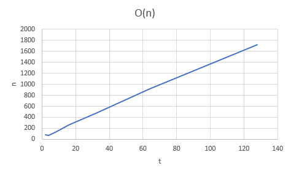

# L1 Uge 5

## A

### A1 (Cormen at al. problem 1.1 side 14)

1-1 Comparison of running times
For each function $f (n)$ and time $n$ in the following table, determine the largest
size $n$ of a problem that can be solved in time $n$, assuming that the algorithm to
solve the problem takes $f (n)$ nanoseconds.

  .         | 1 second  | 1 minute    | 1 hour                | 1 day   | 1 month   | 1 year    | 1 century  
---         | ---       | ---         | ---                   | ---     | ---       | ---       | ---
$\log n$    |           |             |                       |         |           |           |
$\sqrt{n}$  |           |             |                       |         |           |           |
$n$         | $10^9$    |             | $3.6 \cdot 10^{12}$   |         |           |           |
$n\log n$   | $39620077$|             | $98574774544$         |         |           |           |
$n^2$       | $31622$   |             | $1897366$             |         |           |           |
$n^3$       | $1000$    |             | $15326$               |         |           |           |
$2^n$       | $29$      |             | $41$                  |         |           |           |
$n!$        |           |             |                       |         |           |           |

$1 s = 10^9 ns$

$1 h = 3600 s = 3.6 \cdot 10^{12} ns$

#### $n$ (1s - 1m)

$n = 1s => n = 10^9$

$n = 3600s => n = 3.6 \cdot 10^{12}$

#### $n \log n$ (1s - 1m)

$n \log n = 10^9 ns => n = 39620077$

$n \log n = 3.6 \cdot 10^{12} ns => n = 98574774544$

#### $n^2$ (1s - 1m)

$n^2 = 10^9 ns => n = 31622$

$n^2 = 3.6 \cdot 10^{12} ns => n = 1897366$

#### $n^3$ (1s - 1m)

$n^3 = 10^9 ns => n = 1000$

$n^3 = 3.6 \cdot 10^{12} ns => n = 15326$

#### $2^n$ (1s - 1m)

$2^n = 10^9 ns => n = 29$

$2^n = 3.6 \cdot 10^{12} ns => n = 41$

### A2

Vis at hvis alle brikker ikke står på deres korrekte pladser i starten, så kræves mindst
$n/2$ ombytninger for at løse puslespillet.

Hvis vi antager at ingen brikker er på deres korrekte plads, så skal alle brikker flyttes mindst én gang, og hvis vi så antager at brikkerne ligger således at det er muligt at flytte dem så at hver gang vi bytter to, plaseres begge på deres korrekte pladser. Med det får vi at vi kun skal bruge halvt så mange byttninger som der er brikker, altså $n/2$

### A3

Angiv et puslespil med 4 brikker og en optimal følge af ombytninger for det givne
puslespil (en følge af ombytninger der indeholder det mindst mulig antal ombytninger),
men hvor ikke alle ombytninger flytter mindst ´en brik til den korrekte plads.


### A4

[java](java/L1.java)

### A5

[java](java/L1.java)

```java
private static int cycles(ArrayList<Integer> list){ //cost      times
  int count = 0;                                    //c1        1
  int max = list.size();                            //c2        1
  for(int i = 0; i < max; i++){                     //c3        n
      int origin = list.get(i);                     //c4        n-1
      if(origin != -1){                             //c5        n-1
          int j = origin;                           //c6        n-1
          int num;                                  //c7        n-1
          do {                                      //c8        n-1
              num = list.get(j);                    //c9        n-1
              list.set(j,-1);                       //c10       n-1
              j = num;                              //c11       n-1
          } while (num != origin);                  //c12       n-1
          count++;                                  //c13       n-1
      }                                             //
  }                                                 //
  return count;                                     //c14       1
}
```

Samlet:
$$ c \cdot n $$
Best case, we still have to iterate hole array

Worst case, we iterate hole array and only do the operations in the do-while once per index



## B

### B1

  .         | 1 second  | 1 minute    | 1 hour                | 1 day   | 1 month   | 1 year                  | 1 century  
---         | ---       | ---         | ---                   | ---     | ---       | ---                     | ---
$\log n$    |           |             |                       |         |           |                         |
$\sqrt{n}$  |           |             |                       |         |           |                         |
$n$         | $10^9$    |             | $3.6 \cdot 10^{12}$   |         |           | $3.1536 \cdot 10^{16}$  | $3.1536 \cdot 10^{18}$
$n\log n$   | $39620077$|             | $98574774544$         |         |           | $6.4113 \dot 10^{14}$   | $5.6665 \cdot 10^{16}$
$n^2$       | $31622$   |             | $1897366$             |         |           | $177583783$             | $1775837830$
$n^3$       | $1000$    |             | $15326$               |         |           | $315938$                | $1466455$
$2^n$       | $29$      |             | $41$                  |         |           | $54$                    | $61$
$n!$        |           |             |                       |         |           |                         |

$1 y = 365 d = 8760 h = 3.1536 \cdot 10^{16} ns$

$1 c = 100 y = 3.1536 \cdot 10^{18} ns$

#### $n$ (1y - 1c)

$n = 1 y = 3.1536 \cdot 10^{16}$

$n = 1 c = 3.1536 \cdot 10^{18}$

#### $n \log n$ (1y - 1c)

$n \log n = 3.1536 \cdot 10^{16} ns => n = 6.4113 \dot 10^{14}$

$n \log n = 3.1536 \cdot 10^{18} ns => n = 5.6665 \cdot 10^{16}$

#### $n^2$ (1y - 1c)

$n^2 = 3.1536 \cdot 10^{16} ns => n = 177583783$

$n^2 = 3.1536 \cdot 10^{18} ns => n = 1775837830$

#### $n^3$ (1y - 1c)

$n^3 = 3.1536 \cdot 10^{16} ns => n = 315938$

$n^3 = 3.1536 \cdot 10^{18} ns => n = 1466455$

#### $2^n$ (1y - 1c)

$2^n = 3.1536 \cdot 10^{16} ns => n = 54$

$2^n = 3.1536 \cdot 10^{18} ns => n = 61$

### B2

[java](java/L1.java)
