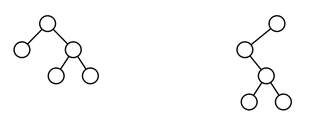
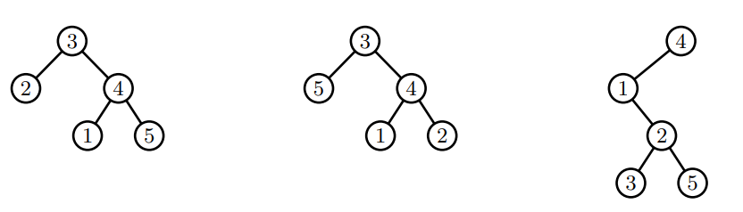
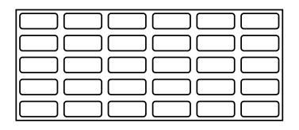
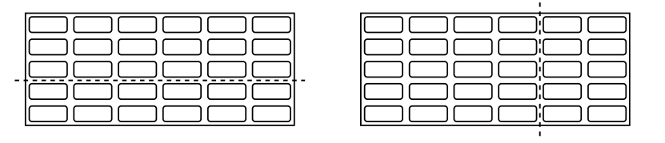

# L10 uge 14

## A

### A1 Eksamen juni 2016, opgave 1

Denne opgave handler om følgende rekursionsligninger;

i. $$T(n) = 2 \cdot T(n/2) + 1$$
ii. $$T(n) = 3 \cdot T(n/3) + n$$
iii. $$T(n) = 4 \cdot T(n/4) + n \log n$$
iv. $$T(n) = 5 \cdot T(n/5) + n^2$$

a) Angiv for hver rekursionsligning om den kan løses med Master Theorem fra lærebogen, og i givet fald hvilken case det er.

i. kan godt anvende Master Theorem
ii. kan godt anvende Master Theorem
iii. kan ikke anvende Master Theorem
iv. kan godt anvende Master Theorem

b) Angiv løsningen $T(n)$ for hver rekrusionsligning som kan løses med Master Theorem.

i.

$\alpha = \log_2 2 = 1$

$f(n) = O(n)$

case 1.

$T(n) = \Theta(n)$

ii.

$\alpha = \log_3 3 = 1$

$f(n) = \Theta(n)$

case 2.

$T(n) = \Theta(n \log n)$

iv.

$\alpha = \log_5 5 = 5$

$f(n) = \Omega(n)$

case 3.

$5 f(n/5) \le c f(n)$

$5 \cdot (n/5)^2 \le c \cdot n^2 \Rightarrow$

$5 \cdot (n^2/25) \le c \cdot n^2 \Rightarrow$

$n^2/5 \le c \cdot n^2 \Rightarrow$

$1/5 \le c < 1$

case 3 holds.

$T(n) = \Theta(n^2)$

### A2 Eksamen juni 2016, opgave 2

Angiv for hvert af nedenstående udsagn, om de er sande eller falske.

i. $1 = O(2)$ sand

ii. $1 = \Omega(2)$ sand

iii. $n = O(n^2)$ sand

iv. $n = \Omega(n^2)$ sand

v. $3x + 2x^2 + x^3 = \Theta(x + 2x^2 + 3x^3)$ falsk

vi. $\log n = o(n/\log n)$ falsk

vii. $n^{1/2} = o(n/2^n)$ falsk

viii. $\log n = \omega(\log n)$ falsk

ix. $2^n \log n = \omega(2^n)$ falsk

x. $n^2/\log n = O(n(\log n)^2)$ sand

### A3 Eksamen juni 2016, opgave 3

Udfør BUILD-MAX-HEAP(A) på nedenstående array A.

Angiv arrayets udseende bagefter ved at skrive elementerne i rækkefølge fra ventre mod høkre.

$A: \{2,1,5,4,8,6,7,9,3\}$

Efter:

$A: \{9,8,7,5,4,2,6,1,3\}$

### A4 Eksamen juni 2016, opgave 7

Binære træer er foskellige hvis de har forskellig facon. Figuren herunder viser to forskellige binære træer med frem knuder.



a) Hvor mange forskellige binære træer med tre knuder findes der? Svar ved at angiver antallet.

- 5

I resten af opgaven ser vi på binære træer med nøgler i knuderne. To træer er forskellige hvis de har forskellig facon, eller hvis de har samme facon, men forskellig nøgle i mindst én knude. Figuren herunder viser tre forskellige binære træer med fem knuder og nøglerne 1, 2, 3, 4, 5.



b) Hvor mange forskellige binære træer med tre knuder og nøglerne 1, 2, 3 findes der som overholder max-heaporder? Svar ved at angive antallet.

- 6

c) Hvor mange forskellige binære træer med tre knuder og nøglern 1, 2, 3 findes
der som overholder inorder? Svar ved at angive antallet.

- 6

d) Hvor mange forskellige binære træer med tre knuder og nøglern 1, 2, 3 findes der som overholder både inorder og max-heaporder? Svar ved at angive antallet.

- 2

### A5 Eksamen juni 2016, opgave 8

Følgende kode har til formål at beregne $7 \cdot n$ for heltal $n \ge 0$

```txt
GANG-SYV(n):
    x = n
    r = 0
    while x > 0
        x = x - 1
        r = r + 7
    return r
```

Angiv for hvert af nedeståene udsagn om det er en løkke-invaritant for algorithmen (dvs. altid er sandt når testen i starten af while-løkken udføres) for alle input der er heltan $n \ge 0$. (Du behøver ikke argumentere for svarene.)

i. $r = 7n$ falsk

ii. $r < 7n$ falsk

iii. $n - x = 7r$ falsk

iv. $7x + r = 7n$ sand

v. $x \ge 0$ sand

### A6 Eksamen juni 2016, opgave 9

Angiv for hvert af følgende algorithmer deres asymptoriske køretid i $\Theta$-notation som funktion af $n$. Input $n$ er for alle algorithmer et positivt heltal.

```txt
A1(n)
    for i = 1 to n      //n
        j = i           //n
        while j > 0     //n!
            j = j - 1   //n!
```

A1 har køretid $O(n!)$

```txt
A2(n)
    i = 1           //1
    while i < n     //n log n
        i = i * 2   //n log n
```

A2 har køretid $O(n \log n)$

```txt
A3(n)
    i = 1           //1
    while i < n     //1
        i = i * n   //1
```

A3 har køretid $\Theta(1)$

```txt
A4(n)
    i = 1               //1
    while i < n         //n log n
        s = 0           //n log n
        while s < n     //n log n!
            s = s + 1   //n log n!
        i = i * 2       //n log n
```

A4 har køretid $O(n \log n!)$

### A7 (Cormen et al. exercise 15.1-3 side 370)

Consider a modification of the rod-cutting problem in which, in addtion to a price $p_i$, for each rod, each cut incurs a fixed cost of $c$. The revenue associated with a solution is now the sum of the prices of the pieces minus the costs of making the cuts. Give a dynamic-progamming algorithm to solve this modified problem.

$r_n = max(p_n,r_1 + r_{n-1}-c,r_2+r_{n-2}-c,...,r_{n-1}+r_1-c)$

```txt
MEMOIZED-CUT-ROD-AUX(p,n,r)
    if r[n] >= 0
        return r[n]
    if n == 0
        q = 0
    else q = -inf
        for i = 1 to n - 1
            q = max(q,p[i] + MEMOIZED-CUT-ROD-AUX(p,n-i,r))
    q = max(q-c,p[i])
    r[n] = q
    return q
```

### A8 (Cormen et al. exercise 15.4-1 side 396)

Determine an LCS of $\{1,0,0,1,0,1,0,1\}$ and $\{0,1,0,1,1,0,1,1,0\}$

LCS is $\{1,0,1,0,1,0\}$

### A9 (Cormen et al. exercise 15.4-2 side 396)

Give pseudocode to reconstruct an LCS from the completed $c$ table and the original sequences $X = \{x_1,x_2,...,x_m\}$ and $Y = \{y_1,y_2,...,y_n\}$ in $O(m+n)$ time, without using the $b$ table.

```txt
PRINT-LCS(c,X,Y)
    n = c[X.length,Y.length]
    s = new array[n]
    while i > 0 and j > 0
        if x_i == y_j
            s[n] = x_i
            n = n - 1
            i = i - 1
            j = j - 1
        else if c[i - 1, j] >= c[i, j - 1]
            i = i - 1
        else
            j = j - 1
    for k = 1 to s.length
        print(s[k])
```

This will run at $O(m+n)$

### A10 Eksamen juni 2010, opgave 4

Denne opgave handler om at finde en største fælles væget delsekvens af to strenge. Her har hvert tegn $c$ i alfabetet en vægt $w(c)$ tilknyttet. Eteksemple kunne være alfabetet

Tegn $c$ | a | b | c | d
--- | --- | --- | --- | ---
Vægt $w(c)$ | 2 | 4 | 1 | 3

Vægten af en fælles delsekvens er summen af vægtene af tegnene i delsekvensen. F.eks. er scd en delsekvends af stengene $X = \text{abcd}$ og $Y = \text{bacda}$, og dens vægt er $2+1+3=6$, hvis alfabetets vægte er som angivet ovenfor.

Givet to strenge $X = x_1x_2...x_n$ og $Y = y_1y_2...y_m$ (af længde henholdsvid $n$ og $m$) over et vægtet alfabet ønsker vi at finde den største vægt en fælles delsekvens af $X$ og $Y$ kan have.

Mer generelt lader vi, for $0 \le i \le n$ og $0 \le j \le m$, $W(i,j)$ betegne den største vægt en fælles delsekvens af stengene $X = x_1x_2...x_i$ og $Y = y_1y_2...y_j$ kan have. Svaret på det oprindelige problem er så $W(n,m)$.

$W(i,j)$ kan beskrives ved følgende rekursive formel:

$$W(i,j) = \begin{cases}
0 & \text{if $i = 0$ $\lor$ $j = 0$} \\
\max\{W(i-1,j),W(i,j-1)\} & \text{if $i,j \ge 1$ $\land$ $x_i \ne y_j$} \\
\max\{W(i-1,j),W(i,j-1),W(i-1,j-1)+w(x_i)\} & \text{if $i,j \ge 1$ $\land$ $x_1 = y_j$}
\end{cases}$$

a) Udfyld for strengene $X = \text{abcd}$ og $Y = \text{bacda}$ og overstående vægte for alfabetet tabellen for $W(i,j)$

i \\ j | 0 | 1 | 2 | 3 | 4 | 5
--- | --- | --- | --- | --- | --- | ---
0 | 0 | 0 | 0 | 0 | 0 | 0
1 | 0 | 0 | 2 | 2 | 2 | 2
2 | 0 | 4 | 4 | 6 | 6 | 6
3 | 0 | 4 | 5 | 6 | 7 | 7
4 | 0 | 4 | 7 | 8 | 8 | 10

b) Beskriv en algoritme baseret på dynamisk programmering der givet $X, Y$ og et vægtet alfabet beregner den største vægt en delsekvends af $X$ og $Y$ kan opnå. Analyser algoritmens køretid.

- Algoritmen skal starte fra enden ($W(m,n)$).
- Et 2d/double array anvendes til at gemme værdierne.

```txt
mem = new array[m][n]
mem fill with -1

W(i,j)
    if mem[i,j] != -1
        return mem[i][j]
    else if i == 0 or j == 0
        return 0
    else if i != j
        return max(W(i-1,j),W(i,j-1))
    else
        return max(W(i-1,j),W(i,j-1),W(i-1,j-1)+w[i])
```

c) Argumentér for at den rekursive formel for $W(i,j)$ er korrekt

- Summen af alle vægtene er 10, hvilker også er det den maksimale vægt af den største delsekvens

### A11 Eksamen juni 2013, opgave 7

Chokolade sælges som oftest i firkanted plader med enkeltrykker støbt i $i$ rækker og $j$ sæjler. Figuren herunder illustrerer en $5 \times 6$-plade



Plader produceres på fabrikker i store $i \times j$-plader, mens forbrugerene værdsætter mindre plader. Du har et firma, som lever af at købe store plader og skære dem op i mindre. En plade kan skæres op med snit, som følger en rille mellem enten to rækker eller to søjler, og går tværs over hele pladen. Dette er illustreret herunder.



Efter et snit ka de opståede mindre plader igen skæres op med nye snit.

Du kender prisen, som en forbruger vil betale for de forskellige pladestørrelser, og ønsker at bestemme den bedst mulige opskæring af en stor plade i mindre plader.

I detaljer: Du ved at forbrugerne vil betale $P(k,l)$, for en $k \times l$-plade. Det giver for enhver opskærning en samlet slagspris for stykkerne i opskærningen. De ønsker for en $i \times j$-plade at bestemme den bedste samlede salgspris, der kan opnas ved en opskæring af pladen. Denne salgsprids kaldes $C(i,j)$.

$C(i,j)$ kan beskrives vd følgende rekursive formel:

$$C(i,j) = \begin{cases}
P(1,1) & \text{if $i = 1\ \land \ j = 1$} \\
\max\{P(i,1),\max_{1 \le s < i}\{C(s,1) + C(i-s,1)\}\} & \text{if $i > 1\ \land \ j = 1$} \\
\max\{P(1,j),\max_{1 \le t < j}\{C(1,t) + C(1,j-t)\}\} & \text{if $i = 1\ \land \ j > 1$} \\
\max\{P(i,j),\max_{1 \le s < j}\{C(s,j) + C(i-s,j)\},\max_{1 \le s < i}\{C(i,t) + C(i,j-t)\}\}\} & \text{if $i > 1\ \land \ j > 1$}
\end{cases}$$

a) Giver værdierne for $P(k,l)$, vist i følgende tabel,

k \\ l | 1 | 2 | 3 | 4
--- | --- | --- | --- | ---
1 | 1 | 2 | 3 | 4
2 | 2 | 5 | 7 | 9
3 | 3 | 8 | 10 | 12
4 | 5 | 8 | 17 | 21

beregn indholdet af følgene tabel for $C(i,j)$.

i \\ j | 1 | 2 | 3 | 4
--- | --- | --- | --- | ---
1 | 1 | 2 | 3 | 5
2 | 2 | 5 | 8 | 10
3 | 3 | 7 | 11 | 17
4 | 4 | 10 | 14 | 22

b) Beskriv en algoritme baseret på dynamisk programmering, der giver $n, m$, samt en tabel over $P(k,l)$ for $1 \le k \le n, \ 1 \le l \le m$, beregner $C(n,m)$.
Angiv algoritmens asymptotiske køretid og pladsforbrug som funktion af $n$ og $m$.

- Algoritmen starter fra enden $C(n,m)$
- Der anvendes et array til at holde udregnede værdier, dette array har en størelse på $n \times m$

```txt
mem = new array[n][m]
meme fill with -1

C(i,j)
    if mem[i][j] != -1
        return mem[i][j]
    else if i == 1 and j == 1
        return P[1][1]
    else if i > 1 and j == 1
        s = i - 1
        m = 0
        while s >= 1
            if C(s,1) + C(i - s,1) > m
                m = C(s,1) + C(i - s,1)
            s = s -1
        mem[i][1] = max(P[i][1],m)
        return mem[i][1]
    else if j > 1 amd i == 1
        t = i - 1
        m = 0
        while t >= 1
            if C(1,t) + C(1,j - t) > m
                m = C(1,t) + C(1,j - t)
            t = t -1
        mem[1][j] = max(P[1][j],m)
        return mem[1][j]
    else
        s = i - 1
        t = j - 1
        m = 0
        while s >= 1
            if C(s,j) + C(i - s,j) > m
                m = C(s,j) + C(i - s,j)
            s = s - 1
        while t >= 1
            if C(i,t) + C(i,j - t) > m
                m = C(i,t) + C(i,j - t)
            t = t -1
        mem[i][j] = max(P[i][j],m)
        return mem[i][j]
```

Køretid: $O(n+m)$

Plads: $O(2(n+m))$

## B

### B1 (Cormen et al. problem 2.3 side 41)

Correctness of Horner's rule

The following code fragment implements Horner's rule for evaluating a polynomial

$$P(x) = \sum_{k=0}^{n}a_k x^k \\
=a_0 + x (a_1 + x (a_2 + ... + x(a_{n-1} + xa_n)...))$$

given the coefficients $a_0, a_1, ... , a_n$ and a value for $x$:

```txt
y = 0
for i = n downto 0
    y = a_i + x * y
```

a) In therms of $\Theta$-notation, what is the running time of this code fragment for Horner's rule?

- The for loop runs $n$ times, so the running time is $\Theta(n)$

b) Write pseudoecode to implement the naive polynomial-evaluationg algorithm that computes each term of the polynomial from scratch. What is the running time of this algorithm? How does it compare to Horner's rule?

```txt
y = 0
for i = 0 to n
    y_i = x
    for j = 1 to n
        y_i = y_i * x
    y = y + a_i * y_i
```

- The inner for loop runs $n^2$, so the running time it $\Theta(n^2)$. It is much slower than Horner's rule

c) Consider the following loop invariant:

At the start of each iteration of the for loop of lines 2-3,

$$y = \sum_{k=0}^{n-(i+1)}a_{k+i+1} x^k$$

Interpret a summation with no terms as equaling 0. Following the structure of the loop invariant proof presented in this chapter, use this loop invariant to show that, at termination, $y = \sum_{k=0}^{n} a_k x^k$

- At termination $i = 0$, that means that it is summing up to $n-1$, and running one last time gives the right result.

d) Conclude by arguing that the given code fragment correctly evaluates a polynomial characterized by the coefficients $a_0, a_1, ... , a_n$.

- Evaluation a polymonial is done by summing the terms, and that is what was shown in c).

### B2 (Cormen et al. exercise 4.2-7 side 83)

Show how to multiply the complex numbers $a + bi$ and $c + di$ using only three multiplications of real numbers. The alorithm should take $a, b, c$ and $d$ as input and produce the real component $ac - bd$ and the imaginary component $ad + bc$ seperatly.

$$
Q_1 = (a + b) c = ac + bc\\
Q_2 = (a - b) d = ad - bd\\
Q_3 = (c + d) b = bc + bd\\
R = Q_1 - Q_3\\
Z = Q_2 + Q_3
$$

### B3 (Cormen et al. exercise 15.4-5 side 397)

Give an $O(n^2)$-time alorithm to find the longest monotonically invreasing subsequence of a sequence of $n$ numbers.

- Make a copy of the input list and sort it
- Then run the LCS with the two lists
- The sorting can be done in $o(n^2)$
- Since both lists are of length $n$ the running time will be $O(n^2)$

### B4 (Cormen et al. problem 15-2 side 405)

Longest palindrome subsequence

A palindrome is a nonempty string over some alphabet that read the same forward and backward. Examples of plaindromes are all strings of length 1, civic, racecar, and aibohphobia(fear of palindromes).

Give an efficient alorithm to find the longest palindrome that is a subsequnce of a given input string. For example, given the input character, your algorithm should return carac. What is the running time of your algoritm?

- Make a copy of the string and reverse the order
- Then run LCS on the two strings
- Reversing the string can be done in $\Theta(n/2)$ time
- Since both sting have the same length, the running time is $O(n^2)$, where $n$ is the lenght of the strings
