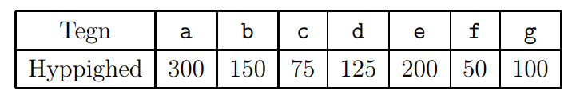
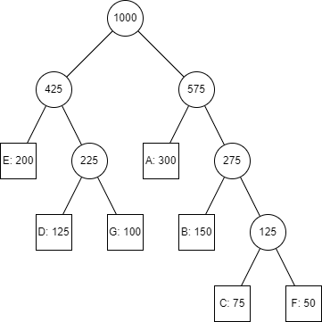
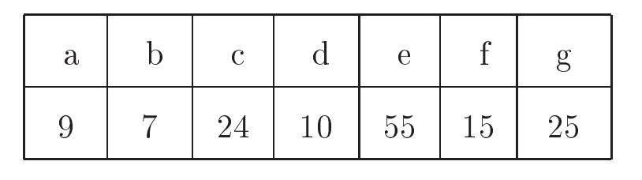
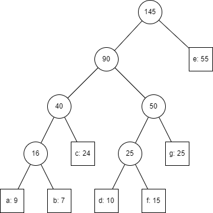
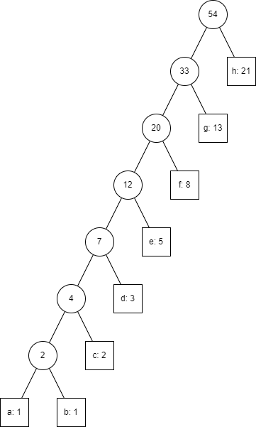

# L11 Uge 15

## A

### A1 Eksamen juni 2010, opgave 1b

Angiv at Hufferman-træ for en streng med fælgedne alfabet og tilhørende hypighed.

### A2 (Cormen et al. øvelse 16.1-4 side 422)

Suppose that we have a set of activities to schedule among a large number of lecture halls, where any activity can take place in any lecture hall. We wish to schedule all the activities using as few lecture halls as possible. Give an efficient greedy algorithm to determine which activity should use which lecture hall. (This problem is also known as the interval-graph coloring problem. We can create an interval graph whose vertices are the given activities and whose edges connect incompatible activities. The smallest number of colors required to color every vertex so that no two adjacent vertices have the same color corresponds to finding the fewest lecture halls needed to schedule all of the given activities.)

- Have to sets of halls. One for busy(B) and one for free(F)
- Sort all activites for stating time
- Go through all the activites
- Every time a new starting time is incountered ad a remove a hall from F and add it to B
- Once an activity is over remove that hall from B and add it to F
- If F is ever empty, a new hall gets added to the set

### A3 (Cormen et al. øvelse 16.1-3 side 422)

Not just any greedy approach to the activity-selection problem produces a maximum-size set of mutually compatible activities. Give an example to show that the approach of selecting the activity of least duration from among those that are compatible with previously selected activities does not work. Do the same for the approaches of always selecting the compatible activity that overlaps the fewest other remaining activities and always selecting the compatible remaining activity with the earliest start time.

- Given $(1,9),(8,11),(10,20)$, we would picking the shortest and elemination the 2 other. If we eleminate the shotest and pick the 2 other we end with 2 activities and not 1. So it is not always the most optimal

### A4 (Cormen et al. øvelse 15.1-2 side 370)

Show, by means of a counterexample, that the following “greedy” strategy does not always determine an optimal way to cut rods. Define the density of a rod of length $i$ to be $p_i / i$, that is, its value per inch. The greedy strategy for a rod of length n cuts off a first piece of length $i$, where $1 \le i \le n$, having maximum density. It then continues by applying the greedy strategy to the remaining piece of length $n - i$

- $p_1 = 0$
- $p_2 = 4$
- $p_3 = 7$
- $n = 4$
- The first cut is of length 3, the other has lenght 1.
- The total price it 7.
- 2 pieces of length 2 has a price of 8.

### A5 (Cormen et al. øvelse 16.2-3 side 427)

Suppose that in a 0-1 knapsack problem, the order of the items when sorted by increasing weight is the same as their order when sorted by decreasing value. Give an efficient algorithm to find an optimal solution to this variant of the knapsack problem, and argue that your algorithm is correct.

- At every step pick the lightest item, it has the most value.
- If we at any point find a lighter item we can just replace it with the heaviest item, since we increase the total value and reduce the weight.

### A6 (Cormen et al. øvelse 16.2-5 side 428)

Describe an efficient algorithm that, given a set $\{x_1,x_2,...,x_n\}$ of points on the real line, determines the smallest set of unit-length closed intervals that contains all of the given points. Argue that your algorithm is correct.

- Looking at the left most interval we find the left most point.
- Remove any point within a unit distance of the left most point.
- Repeat for all points.
- This covers all points

## B

### B1 Eksamen januar 2008, opgave 1a

Betragt alfabetet med de syv tegn a, b, c, d, e, f, g.
Nedestående tabel viser, hvor tit hvert enkelt tegn optræder i en given tekst.

Tegn et Huffman-træ, som repræsenter Huffman-kodern for dette eksempel.

### B2 (Cormen et al. øvelse 16.3-3 side 436)

What is an optimal Huffman code for the following set of frequencies, based on the first 8 Fibonacci numbers?

$$a: 1, b: 1, c: 2, d: 3, e: 5, f: 8, g: 13, h: 21$$

- $a = 0000000$
- $b = 0000001$
- $c = 000001$
- $d = 00001$
- $e = 0001$
- $f = 001$
- $g = 01$
- $h = 1$

Can you generalize your answer to find the optimal code when the frequencies are the first n Fibonacci numbers?

- The n'th finbonacci number is 1
- Every number is $n - m + 1$ long ($m$ is the placement of the numbers)
- The first is a string of 0s
- Every number there after ends in 1

### B3 (Cormen et al. øvelse 16.3-8 side 436)

Suppose that a data file contains a sequence of 8-bit characters such that all 256
characters are about equally common: the maximum character frequency is less
than twice the minimum character frequency. Prove that Huffman coding in this
case is no more efficient than using an ordinary 8-bit fixed-length code.

- Since every character is equally common, the Huffman-tree would initialy be 128 trees with 2 nodes each, in the end the final tree would be a complete binary tree and all nodes would be at the end. This means that every character has the same binary length and we would not same any space.
