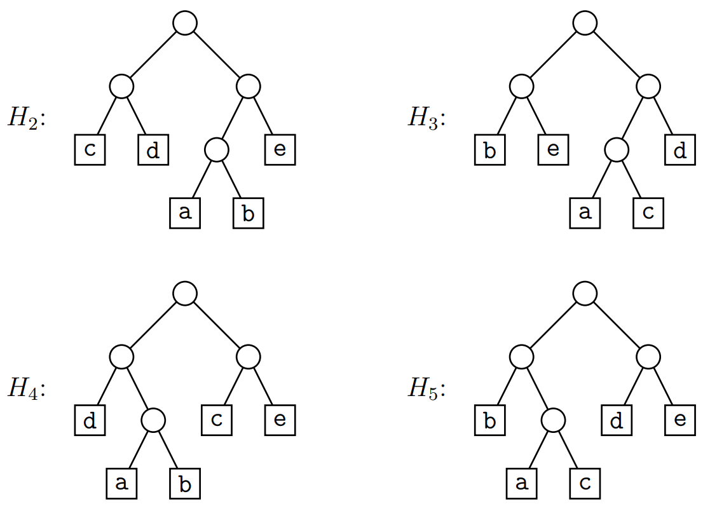

# L12 Uge 16

## A

### A1 Eksamen januar 2007, opgave 2

Denne opgave handler om Huffman-koder.

a) Betragt alfabetet med de seks tegn a, b, c, d, e, f.
Nedestående tabel viser, hvor tit hvert tegn optræder i en given tekst.


Tegn Huffman-træet, som repræsentere Huffman-koderne for dette eksempel.


b) Brug følgende Huffman-træ


til at dekode 1101001010101011

f a c a d e

### A2 Eksamen juni 2012, opgave 5

I denne opgave set vi op en fil som indeholder nedestående tegn med de angivede hypogheder.


Træet $H_1$ er et Huffman-træ for denne fil.


a) Angiv hvor mange bits filen fylder når den er kodet med træet $H_1$.

- a = 3 * 100 = 300
- b = 2 * 150 = 300
- c = 3 * 150 = 450
- d = 2 * 250 = 500
- e = 2 * 350 = 700
- total = 2250

b) Angiv hvad følgende streng dekodes til ved træet $H_1$ (under brug af bogens konvention at 0 svarer til venstre of 1 svarer til højre)

1000000110110101

a b b e d c d

c) Alle træerne $H_2, H_3, H_4$ og $H_5$ er optimale for filen med overstående tabel. Angiv hvilken af træerne som kan fremkomme ved Huffmans algoritme.



$H_2$ og $H_5$

### A3

Vi ser her på disjoints sets implementeret via lænkede lister og brug af
weighted-union heuristikken for Union (dvs. at den korteste liste sættes ind i den længste liste). Beskriv hvordan denne implementation kan
laves, selv hvis header-objekter ikke indeholder en tail-pointer og ikke gemmer listens længde. Den asymptotiske køretid af operationerne
skal selvfølgelig ikke blive ændret. [Hint: løb lister igennem synkront.
Husk opdatering af elementers pointer til header.]

- Hold en size i hver set
- LINK(x,y) sammenligner de 2 sets size og sææter den mindste ind i den længste.

### A4 Cormen et al. øvelse 21.2-2 (side 567)

Dine tegninger behøver ikke
være lige så detaljerede som i Figur 21.1 (side 565).

Show the data structure that results and the answers returned by the FIND-SET operations in the following program. Use the linked-list representation with the weighted-union heuristic

```txt
for i = 1 to 16
    MAKE-SET(x_i)
for i = 1 to 15 by 2
    UNION(x_i, x_i + 1)
for i = 1 to 13 by 4
    UNION(x_1, x_i + 2)
UNION(x_1, x_5)
UNION(x_11, x_13)
UNION(x_1, x_10)
FIND-SET(x_2)
FIND-SET(x_9)
```

Assume that if the sets containing $x_i$ and $x_j$ have the same size, then the operation UNION$(x_i, x_j)$ appends $x_j$’s list onto $x_i$’s list.

- Line 1 $\{1\},\{2\},\{3\},\{4\},\{5\},\{6\},\{7\},\{8\},\{9\},\{10\},\{11\},\{12\},\{13\},\{14\},\{15\},\{16\}$
- Line 3 $\{1,2\},\{3,4\},\{5,6\},\{7,8\},\{9,10\},\{11,12\},\{13,14\},\{15,16\}$
- Line 5 $\{1,2,3,4\},\{5,6,7,8\},\{9,10,11,12\},\{13,14,15,16\}$
- Line 7 $\{1,2,3,4,5,6,7,8\},\{9,10,11,12\},\{13,14,15,16\}$
- Line 8 $\{1,2,3,4,5,6,7,8\},\{9,10,11,12,13,14,15,16\}$
- Line 9 $\{1,2,3,4,5,6,7,8,9,10,11,12,13,14,15,16\}$
- Line 10 return pointer to $x_1$
- Line 11 retrun pointer to $x_1$

### A5 Cormen et al. øvelse 21.3-2 (side 572)

[Hint: løb stien igennem to gange.]

Write a nonrecursive version of FIND-SET with path compression.

```txt
FIND-SET(x)
    A = new LinkedList
    A.insert(x)
    while x != root
        x = x.p
        A.insert(x)
    for each pointer in A
        pointer.p = root
```

### A6 Cormen et al. øvelse 21.3-1 (side 572)

Redo Exercise 21.2-2 using a disjoint-set forest with union by rank and path compression.


### A7 Cormen et al. øvelse 22.1-1 (side 592)

Given an adjacency-list representation of a directed graph, how long does it take to compute the out-degree of every vertex? How long does it take to compute the in-degrees?

- out-degree: $\sum_{v \in V} O(out-degree(v)) = O(|E| + |V|)$
- in-degree: $O(|E| + |V|)$

### A8 Cormen et al. øvelse 22.1-3 (side 592)

The transpose of a directed graph $G = (V,E)$ is the graph $G^T = (V,E^T)$, where $E^T = \{(v,u) \in V \times V : (u,v) \in E \}$. Thus, $G^T$ is $G$ with all its edges reversed. Describe efficient algorithms for computing $G^T$
from $G$, for both the adjacencylist and adjacency-matrix representations of $G$. Analyze the running times of your algorithms.

//TODO

### A9 Cormen et al. øvelse 22.2-1 (side 601)

### A10 Cormen et al. øvelse 22.2-2 (side 601)

### A11 Cormen et al. øvelse 22.2-3 (side 602)

NB: Hvis jeres bog ikke er
“third printing” (eller senere) af third edition af Cormen et al., st˚ar
der fejlagtigt “if lines 4 and 14 were removed” - det skal ændres til “if
line 18 was removed”.

## B

### B1 Eksamen juni 2011, opgave 3

I dennne opgave ser vi på sortering i to special-tilfælde:

1. Alle nøgler er forskellige, og input er omvendt sorteret; d.v.s. nøglerne optræder i faldende orden. Eks: $\{12,9,8,5,2\}$.
2. Alle nøgler er ens. Eks: $\{5,5,5,5,5\}$.

I begge tilfælde antages det, at alle nøgler er heltal mellem 0 og $n^5$, hvor $n$ er antallet af nøgler, det skal sorteres.

a) Angiv køretiden for Insetion Sort i hvert af de to tilfælde.

1. $\Theta(n^2)$
2. $\Theta(n)$

b) Angiv køretiden for Qucik Sort i hvert af de to tilfælde.

1. $\Theta(n^2)$
2. $\Theta(n^2)$

c) Angiv køretiden for Heap sort i hvert af de to tilfælde.

1. $\Theta(n \log n)$
2. $\Theta(n)$

d) Angiv den bedst mulige køretid for Radis Sort i hvert af de to filælde.

1. $\Theta(n)$
2. $\Theta(n)$

### B2 Eksamen januar 2007, opgave 1

Sidehenvisningerne skal være til side 298 (opgave b) og 294 (opgave c) i vores udgave (tredie) af Cormen
et al., i stedet for de angivne sider 261 og 262.

a) Er nedstående et binæry søgetræ?


- Ja, hver knudes venster sub-træ indeholder kun mindre elementer, og højre sub-træ inholder størrer elementer.

b) Betragt nedenstående binære søgetræ. Tegn træet som det set ud, efter knuden med nøglen 5 er slettet. Du skal bruge algoritmen fra æørebogen (s. 261).


- 5 har både en venstre og højre under-træ
- Det mindster barn i 5's højre sub'træ bliver den nye root


c) Betragt nedenstående binære søgetræ. Tegn træet, som det ser ud, efter en knude med nølgen 16 er blevet indsat. De skal bruge algoritmen fra lærebogen (s. 262).


### B3 (∗) Cormen et al. problem 16.1 (side 446)

Erstat spørgsmål b med
flg. mere generelle: Vis, at hvis der for et møntsæt med møntstørrelser $m_1 = 1, m_2, ... , m_k$ gælder at $m_i$ går op i $m_i+1$ for alle $i$, da virker den grådige algoritme fra spørgsmål a. Hint til spørgsmål a: Quarters, dimes, nickels og pennies betyder 25-ører, 10-ører, 5-ører og 1-ører. Du skal vise, at der altid er en optimal løsning bestående af dit første grådige valg samt en optimal løsning til rest-problemet. Det kan hjælpe at se på en optimal løsning, og stille dens mønter op sorteret efter størrelse. Hint til spørgsmål b: er ikke så forskellig fra spørgsmål a. Hint til spørgsmål c: et møntsæt med tre mønter og et beløb n under ti er nok til et modeksempel. Hint til spørgsmål d: Man må her bruge dynamisk programmering i stedet for grådighed. Det vil være nok med en tabel R[i] af størrelse 1 × n, hvor R[i] indeholder antallet af mønter i en optimal løsning for beløbet i. Tænk derudover lidt som for guldkæde-problemet (se slides om dynamisk programmering)—en optimal løsning for beløb i må indeholde enten en mønt af type 1, eller en af type 2, eller en af type 3, og s˚a videre. Bemærk at problem 16.1 viser, at design af et lands møntsæt kræver overvejelser, for at det bliver simpelt (dvs. en naturlig grådig algoritme fungerer) at give penge tilbage.

Consider the problem of making change for $n$ cents using the fewest of coins. Assume that each coin's value is an integer.

a) Describe a greedy algorithm to make change consisting of quarters, dimes, nickles, and pennies. Prove that your algorithm yields an optimal solution.

- Give the highest possible coin without going over the amount. Repeat until the change amount is met.

b) Vis, at hvis der for et møntsæt med møntstørrelser $m_1 = 1, m_2, ... , m_k$ gælder at $m_i$ går op i $m_i+1$ for alle $i$, da virker den grådige algoritme fra spørgsmål a.

- The value of $m_i$ is the same as $i$ and since we only increment by 1 each time, the previous coin is alway less than the next.

c) Give a set of coin denominations for which the greedy algorithm does not yield an optimal solution. Your set should include a penny so that there is a solution for every value of $n$.

- Coin denominations: 1, 3, 4
- Change of 6 would yield: 4, 1, 1
- Optimal would be: 3, 3

d) Give an $O(nk)$-time algorithm that makes change for any set of $k$ different coin denominations, assuming that one of the coinds is a penny.

```txt
MAKE-CHANGE(S,v)
    numcoins = new array[v.length]
    coin = new array[v.lenght]
    for i = 1 to v
        bestcoin = nil
        bestnum = inf
        for c in S
            if numcoins[i - c] + 1 < bestnum
                bestnum = numcoins[i - c]
                bestcoin = c
        numcoins[i] = bestnum
        coin[i] = bestcoin
    change = new set
    iter = v
    while iter > 0
        change.insert(coin[iter])
        iter = iter - coin[iter]
    return change
```

- First for-loop runs n times, inner for-loop runs k times. While-loop runs n times. Total $O(nk)$

### B4 Eksamen juni 2009, opgave 1 a

a) Udfør HEAP-EXTRACT-MAX på den binære hob repræsenteret ved nedenstående array.


Vis hvert skridt. Det kan være en god ide at tegne træ-repræsentationen fremfor array-repræsentationen.


### B5 Eksamen januar 2005, opgave 5

Denne opgave handler om at sortere $n$ heltal med mange dubletter.

a) Beskriv en algoritme, det sorterer $n$ heltal i tid $O(n \log (\log n))$, hvis der kun er $O(\log n)$ forskellige tal. Det antages, at to tal kan sammenlignes i konstant tid (d.v.s. i tid $O(1)$). Hint: benyt en passende valgt datastruktur til at insætte i, og saml dubletterne.
Bemærk, at forskellen mellem to tal sagtens kan være $\omega(\log n)$. D.v.s. selvom der kun er $O(\log n)$ forskellige tal, kan der være stor forskel på størrelsen af tallene.
Forklar, hvordan den sorterede følge kan aflæses fra datastrukturen og udskrives i tid $O(n)$.

- Vi kan anvende et Rød-Sort træ. I hver knude anvendes en tæller for hvor mange gange et tal gentages. Her vil det kun være $O(\log n)$ knuder.

- Ved brug af en tæller for træet en højde på $O(\log(\log n))$, og når der så sættes $n$ tal ind giver det en samlet køretid på $\Theate(n \log (\log n))$

- Aflæsninen af Rød-Sort træet vil forgå ved at bruge INORDER, men når en knude besøges skrives et tal ud det antal gange angivet af tælleren. INORDER tager $O(k)$, hvor $k$ er antallet af knuder. Det skal i alt udskrives $n$ tal, så køretiden bliver $\Theta(n)$.

### B6 Eksamen juni 2010, opgave 5

I denne opgave ønsker vi at udvide binære søgetræer med oplysninger om afstandene mellem de gemte nøgler, og specielt ønsker vi at kunne finde den største afstand i træet mellem en nøgle og dens predecessor.

Mere præcist, hvis et søgetræ gemmer $n$ nøgler $x_1 \le x_2 \le x_3 \le · · · \le x_n$, er de søgte afstande $(x2 −x1),(x3 −x2), · · · ,(x_n −x_n−1)$, og vi ønsker at kunne finde den største af disse. Hvis eksempelvis nøglerne gemt i træet er 3, 5, 11, 14, 23 og 30, er afstandene 2, 6, 3, 9 og 7, og største afstand er 9, som opnås mellem nøglen 23 og den predecessor 14.

Vi udstyrer nu enhver knude v i søgetræet med følgende tre ekstra informationer (udover den i knuden gemte nøgle v.key):

1. Største afstand mellem nøgler gemt i v’s undertræ (v.maxGap).
2. Største nøgle gemt i v’s undertræ (v.max).
3. Mindste nøgle gemt i v’s undertræ (v.min).

(Husk at en knudes undertræ inkluderer knuden selv. Hvis der kun er én nøgle i v’s undertræ, sættes v.maxGap lig nul.)

Specielt kan største afstand i træet herved aflæses af roden r’s information r.maxGap i O(1) tid. Et eksempel på et binært søgetræ og informationen i en af dets knuder kan ses i Figur 6.

a) Angiv hvordan en knudes information kan bestemmes i $O(1)$ tid ud fra informationerne i knudens to børn, samt knudens og børnenes nøgler.

```txt
v.maxGap = max(v.left.maxGap, v.right.maxGap, (v.key - v.left.max), (v.right.min - v.key))
```

Vi lader nu søgetræet være et rød-sort træ.

b) Argumenter for at informationernei træets knuder kan vedligeholdes under insættelse og sletning, uden at ændre køretiden $O(\log n)$ for disee.

- Hvis vi kan opdatere informationerne i $O(1)$ tid kan dette gøre for knuder efter insættelse of sletning, unden at ændre på køretiden.

Som sagt kan man i $O(1)$ tid finde den største afstand i træet mellem nøgler og deres predecessors ved at aflæse roden r's informationer $r.maxGap$. Vi ønsker nu også at kunne finde en konkret nøgle i træet som har denne afstand til sin predecessor.

c) Beskriv en søgeproces som i $O(\log n$ tid finder en sådan nøgle.

- Her bruges en rekursiv søgealgoritme. Den starter i roden og går detefter ned af højre eller venstre undertræ. I hver søgning undersøges: $(v.key - v.left.max), (v.right.min - v.key), v.left.maxGap, v.right.maxGap$; Om hvilken værdi, som er lige med $v.maxGap$. Case 1 returnerer $v.key$, case 2 returner $v.right.min$, case 3 laver et rekursivt kald på $v.left$ og case 4 lavet er rekursivt kald på $v.right$.
