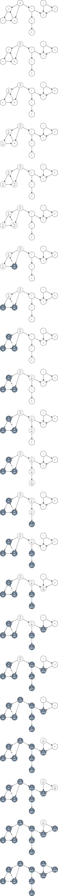

# L13 Uge 17

## A

### A1 Cormen et al. øvelse 22.3-2 (side 610)

Show how depth-first search works on the graph of Figure 22.6. Assume that the for loop of lines 5–7 of the DFS procedure considers the vertices in alphabetical order, and assume that each adjacency list is ordered alphabetically. Show the discovery and finishing times for each vertex, and show the classification of each edge.




### A2 Eksamen juni 2010, opgave 2, spørgsmål a og b

a) For alle knuder $v$ i graphen $G_1$, angiv distanceværdien $v.d$ som tildeles ved bredde-først søgning (BFS) med start i knuden $s$.


b) For alle knuder $v$ i graphen $G_2$, angiv starttiden (discovery time) $v.d$ og sluttiden (finishing time) $v.f$ som tildeles ved dybde-først søgning (DFS) med start i knuden $s$


### A3 Cormen et al. øvelse 22.3-4 (side 611)

NB: Hvis jeres bog ikke er “third printing” (eller senere) af third edition af Cormen et al., står
der fejlagtigt “if line 3 was removed” - det skal ændres til “if line 8
was removed”.

Show that using a single bit to store each vertex color suffices by arguing that
the DFS procedure would produce the same result if line 8 of DFS-VISIT was
removed.

- 0 for white
- 1 for grey and black
- a node is only checked for white

### A4 Cormen et al. øvelse 22.3-10 (side 612)

For denne udvidelse af DFS er det nødvendigt at DFS bruger alle farverne hvid, grå og sort (modsat
Cormen et al. øvelse 22.3-4 ovenfor).

Modify the pseudocode for depth-first search so that it prints out every edge in the
directed graph G, together with its type. Show what modifications, if any, you need
to make if G is undirected.

```txt
DFS-VISIT(G,u)
    time = time + 1
    u.d = time
    u.color = GREY
    for each v in G.Adj[u]
        if v.color == WHITE
            print(u,v is a Tree edge)
            v.pi = u
            DFS-VISIT(G,v)
        else if v.color == GRAY
            print(u,v is a Back edge)
        else
            if v.d > u.d
                print(u,v is a Forward edge)
            else
                print(u,v is a Cross edge)
    u.color = BLACK
    time = time + 1
    u.f = time
```

### A5 Cormen et al. øvelse 22.4-1 (side 614)

Show the ordering of vertices produced by TOPOLOGICAL-SORT when it is run on
the dag of Figure 22.8, under the assumption of Exercise 22.3-2.


v | start | finish
:---: | :---: | :---:
m | 1 | 20
n | 21 | 26
o | 22 | 25
p | 27 | 28
q | 2 | 5
r | 6 | 19
s | 23 | 24
t | 3 | 4
u | 7 | 8
v | 10 | 17
w | 11 | 14
x | 15 | 16
y | 9 | 18
z | 12 | 13

Ordering: $p, n, o, s, m, r, y, v, x, w, z, u, q, t$

### A6 Cormen et al. øvelse 22.4-5 (side 615)

Argumentér for både korrekthed og køretid.

Another way to perform topological sorting on a directed acyclic graph $G = (V, E)$ is to repeatedly find a vertex of in-degree 0, output it, and remove it and all of its outgoing edges from the graph. Explain how to implement this idea so that it runs in time $O(V + E)$. What happens to this algorithm if $G$ has cycles?

//TODO

## B

### B1 Cormen et al. øvelse 22.4-3 (side 615)

Der må her bruges, at hvis der for en uorienteret graf gælder |E| ≥ |V|, så har grafen en kreds (dette følger af sætning B.2, punkt 5 og 6 (side 1174)).

Give an algorithm that determines whether or not a given undirected graph $G = (V, E)$ contains a simple cycle. Your algorithm should run in $O(V)$ time, independent of $|E|$.

- We can use DFS and terminate if at any point we get a visited node while searching.

### B2 (∗) Cormen et al. øvelse 22.2-7 (side 602)

Opgaven er formuleret lidt opstyltet. Den handler kort sagt om for en uorienteret graf at afgøre, hvorvidt man kan opdele knuderne i to delmængder A og B, således at enhver kant har dens ene endepunkt liggende i A og det andet i B (dvs. ingen kant har begge sine endepunkter i den samme af disse to mænger). Hint: brug BFS. Opgaverne nedenfor er repetition af tidligere stof.

There are two types of professional wrestlers: “babyfaces” (“good guys”) and “heels” (“bad guys”). Between any pair of professional wrestlers, there may or may not be a rivalry. Suppose we have n professional wrestlers and we have a list of r pairs of wrestlers for which there are rivalries. Give an $O(n + r)$-time algorithm that determines whether it is possible to designate some of the wrestlers as babyfaces and the remainder as heels such that each rivalry is between a babyface and a heel. If it is possible to perform such a designation, your algorithm should produce it.

- We use BFS and use the d value to decide the nodes
- Even nodes gets to be babyfaces
- Odd is heels

### B3 Eksamen juni 2012, opgave 1

a) Angiv en farvning af knuderne i træet $T_1$ som gør det til et rød-sort træ.
(Svar ved at skrive en liste af navnene på de sorte knuder og en liste med navnene på de røde knuder).


- Sort: a, b, c, d, e, g, h, i
- Rød: f

b) Angiv alle farvninger af knuderne i træet $T_2$ som gør det til et rød-sort træ.
(Svar ved at skrive en liste af navnene på de sorte knuder og en liste med navnene på de røde knuder).


1

Sort: a, d, e, f, g, h, i, j, k, l, m, n, o

Rød: b, c

2

Sort: a, b, c, d, e, f, g, h, i, j, k, l, m, n, o

Rød:

3

Sort: a, b, c, h, i, j, k, l, m, n, o

Rød: d, e, f, g

4

Sort: a, c, d, e, h, i, j, k, l, m, n, o

Rød: b, f, g

5

Sort: a, b, f, g, h, i, j, k, l, m, n, o

Rød: c, d, e

### B4 Eksamen juni 2012, opgave 3

a) Angiv løsningen til følgende rekrusionslignig.

$$T(n) = 8 \cdot T(n/4) + n^{1.5}$$

- $a = 8$
- $b = 4$
- $f(n) = n^{1.5}$
- $\alpha = \log_4(8) = 1.5$
- $f(n) = \Theta(n^\alpha)$

Case 2.

$$T(n) = \Theta(n^{1.5} \log n)$$

b) Angiv for hver af følgende rekursionsligninger om de kan løses ved hjælp af master theorem (Theorem 4.1) i lærebogen. For hver ligning hvor svaret er positivt, angiv hvilken af de tre cases i master theorem som løser dem. (Du behæver ikke angive selve løsningen).

$$T(n) = 14 \cdot T(n13) + n$$

- $a = 14$
- $b = 13$
- $f(n) = n$
- $\alpha = \log_{13}(14) = \frac{\log 14}{\log 13} > 1$
- $f(n) = O(n^{\alpha + \epsilon})$

Case 1.

$$T(n) = 13 \cdot T(n/13) + n \log n$$

- $a = 13$
- $b = 13$
- $f(n) = n \log n$
- $\alpha = \log_{13}(13) = 1$
- $f(n) = \Omega(n^{1 + \epsilon})$

Case 3.

$$\frac{n \log n}{n^{1 + 0.01}} = \frac{\log n}{n^{0.01}} \rightarrow 0 \ \text{for}\ n \rightarrow \infin$$

Kan ikke bruge master theorem.

$$T(n) = 14 \cdot T(n/13) + n \log n$$

- $a = 14$
- $b = 13$
- $f(n) = n \log n$
- $\alpha = \log_{13}(14) = \frac{\log 14}{\log 13} > 1$
- $f(n) = O(n^{\alpha - \epsilon})$

Case 1.

$$T(n) = 13 \cdot T(n/14) + n$$

- $a = 13$
- $b = 14$
- $f(n) = n$
- $\alpha = \log_{14}(13) = \frac{\log 13}{\log 14} < 1$
- $f(n) = \Omega(n^{\alpha + \epsilon})$

$$13 f(n / 14) \le c f(n)$$

$$13 \cdot n / 14 \le c n$$

$$13/14 \cdot n \le cn$$

$$13/14 \le c < 1$$

Case 3.
