# L14 Uge 18

## A

### A1 Opgave 1, 2, 3, 4 og 6 fra eksamenssættet fra juni 2014

Opg 1

a) Angiv løsningerne til følgende rekursionsligninger.

$$T(n) = 2 \cdot T(n/3) + n$$

- $a = 2$
- $b = 3$
- $f(n) = n$
- $\alpha = \log_3 2 = \frac{\log 2}{\log 3} \approx 0.63$
- $f(n) = \Omega(n^{\alpha - \epsilon})$

Case 3.

Extra condition

- $2 \cdot f(n/3) \le c \cdot f(n)$
- $2 \cdot n/3 \le c n$
- $2/3 \le c < 1$

$$T(n) = \Theta(n)$$

$$T(n) = 32 \cdot T(n/4) + n^{2.5}$$

- $a = 32$
- $b = 4$
- $f(n) = n^{2.5}$
- $\alpha = \log_4 32 = 2.5$
- $f(n) = \Theta(n^\alpha)$

Case 2.

$$T(n) = \Theta(n^{2.5} \log n)$$

Opg 2

Angiv for hvert af nedenstående udsagn, om de er sande eller falske.

i. $n^2 = O(n^2)$ - sand

ii. $n^2 = \Theta(n^2)$ - sand

iii. $n^4 = O(5n^3 + 3n^5)$ - sand

iv. $n^4 = \Theta(5n^3 + 3n^5)$ - falsk

v. $n \log n = O(n^{1.5})$ - sand

vi. $n = O(\log n)$ - falsk

vii. $(\log n)^{10} = O(n^{0.10})$ - sand

viii. $1 = O(n)$ - sand

ix. $n^2 = o(n^3)$ - sand

x. $n^3 = \omega(n^3)$ - falsk

Opg 3

Angiv udseendet af nedenstående array efter at have udført BUILD-MAX-HEAP på det.

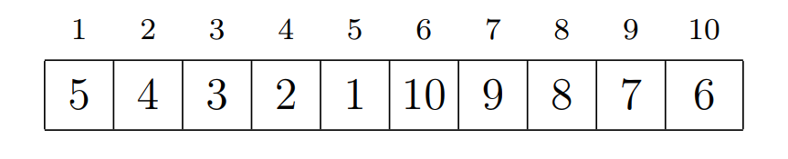

Svar ved at skrive elementerne i rækkefølge fra ventre mod højre.

- $10, 8, 9, 7, 6, 3, 5, 2, 4, 1$

Opg 4

Nedenstående er en hashtabel $H$ der bruger double hashing med de to auxiliary hashfunktioner

$$h_1(x) = (5x + 1) \mod 13$$
$$h_2(x) = 1 + (x \mod 12)$$

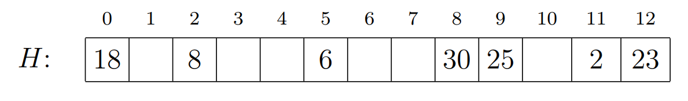

Indsæt værdierne 3, 5 og 15 (i den rækkefølge). Angiv udseendet af hashtabellen efter den sidste af de tre insættelser.

Svar ved at skrive indholdet af $H$ i rækkefølgen fra venstre mod højre, med tomme pladser angivet som x.

$$h(k,i) = ((5k + 1) \mod 13 + i \cdot(1 + (k \mod 12))) \mod m$$

Insæt 3:

$$h(3,0) = ((5 \cdot 3 + 1) \mod 13 + 0 \cdot(1 + (3 \mod 12))) \mod 13$$
$$h(3,0) = (3) \mod 13 = 3$$

Indsæt 5:

$$h(5,0) = ((5 \cdot 5 + 1) \mod 13 + 0 \cdot(1 + (5 \mod 12))) \mod 13$$
$$h(5,0) = (0) \mod 13 = 0$$

$$h(5,1) = ((5 \cdot 5 + 1) \mod 13 + 1 \cdot(1 + (5 \mod 12))) \mod 13$$
$$h(5,1) = (6) \mod 13 = 6$$

Indsæt 15:

$$h(15,0) = ((5 \cdot 15 + 1) \mod 13 + 0 \cdot(1 + (15 \mod 12))) \mod 13$$
$$h(15,0) = (11) \mod 13 = 11$$

$$h(15,1) = ((5 \cdot 15 + 1) \mod 13 + 1 \cdot(1 + (15 \mod 12))) \mod 13$$
$$h(15,1) = (15) \mod 13 = 2$$

$$h(15,2) = ((5 \cdot 15 + 1) \mod 13 + 2 \cdot(1 + (15 \mod 12))) \mod 13$$
$$h(15,2) = (19) \mod 13 = 6$$

$$h(15,3) = ((5 \cdot 15 + 1) \mod 13 + 3 \cdot(1 + (15 \mod 12))) \mod 13$$
$$h(15,3) = (23) \mod 13 = 10$$

Final

- $18, x, 8, 3, x, 6, 5, x, 30, 25, 15, 2, 23$

Opg 6

En fil indeholder nedenstående tegn med de angivne hyppigheder. Der er 1900 tegn i alt.

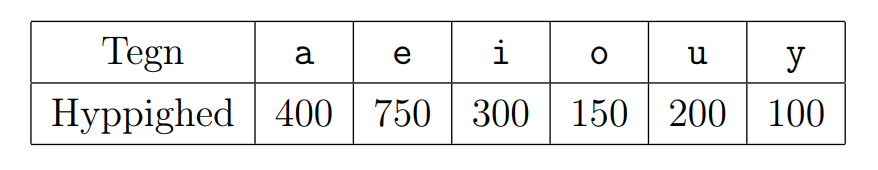

Lav et Huffman-træ på dette input. Angiv det resulterende kodeord for hvert af tegnene a, e, i, o, u og y, og angiv også hvor mange bits den kodede fil fylder (dvs. angiv den samlede længe af de 1900 kodede tegn)

a = 1 1 1
e = 0
i = 1 1 0
o = 1 0 1 1
u = 1 0 0
y = 1 0 1 0

Bits:

$a = 3 \cdot 400 = 1200$

$e = 1 \cdot 750 = 750$

$i = 3 \cdot 300 = 900$

$o = 4 \cdot 150 = 600$

$u = 3 \cdot 200 = 600$

$y = 4 \cdot 100 = 400$

$total = 1200 + 750 + 900 + 600 + 600 + 400 = 4450$

### A2 Cormen et al. øvelse 22.5-1 (side 620)

Svar også på samme spørgsmål for sammenhængskomponenter i uorienterede grafer.

How can the number of strongly connected components of a graph change if a new edge is added?

- It stays the same of decreases.

### A3 Eksamen juni 2010, opgave 2, spørgsmål d

Du skal (til eksaminatorierne, ikke til eksamen) løse den både med Prim-Jarniks og Kruskals algoritme, og samt vise skridtene undervejs.

For grafen $G_4$, angic et minimum spanning tree (MST), samt dets vægt.

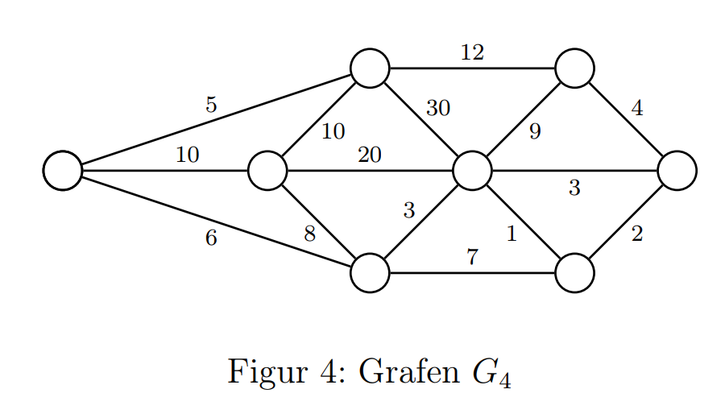

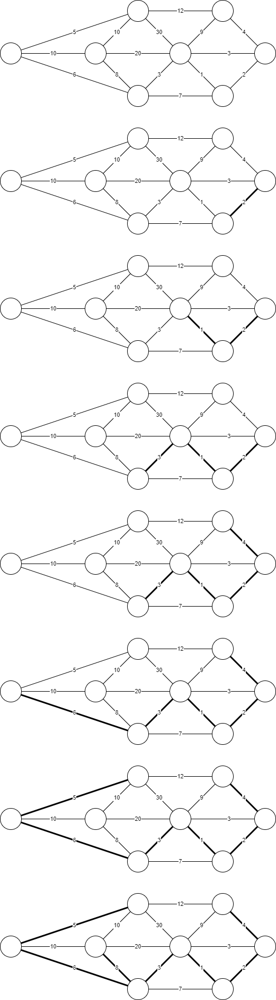

Vægt: $5+6+8+3+1+2+4 = 29$

### A4 Eksamen januar 2008, opgave 2, spørgsmål b

Du skal (til eksaminatorierne, ikke til eksamen) løse den både med Prim-Jarniks og Kruskals algoritme, og samt vise skridtene undervejs.

Tegn et lettest udspændende træ for nedenstående vægtet graf.

Du kan evt. bruge tegningen på sidste side.

Argumenter for, at dit resultat er et lettest udspændende træ.

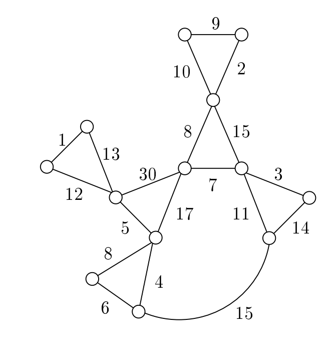

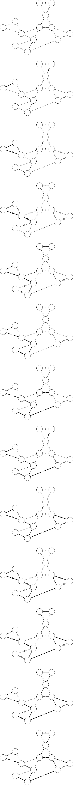

- Det er det letteste udspændende træ, da de tungeste kanter bliver fjernet og det kun er de letteste kanter tilbage.

### A5 Cormen et al. øvelse 23.2-4 (side 637)

Det er nok at svare på første spørgsmål.

Suppose that all edge weights in a graph are integers in the range from 1 to $|V|$. How fast can you make Kruskal’s algorithm run? What if the edge weights are integers in the range from 1 to W for some constant W ?

- $O(E + V)$

### A6 Eksamen juni 2014, opgave 7

Denne opgave handler om at bruge Kruskals algoritme til at find et MST for nedenståene graf $G = (V,E)$. Vi ser i spørgsmål a, b og d på situationen efter at algoritmen har undersøgt 7 kanter (dvs. har lavet 7 iterationer af det andet for-loop på side 631 i lærebogen).

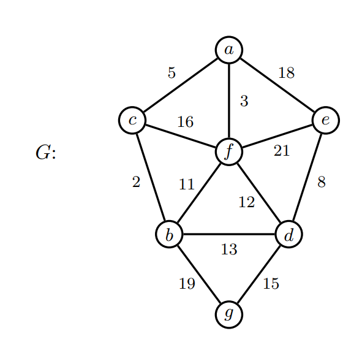

a) Angiv hvilke kanter det er valgt til at indgå i MST'et (dvs. er i A) efter at Kruskals algoritme har undersøgt 7 kanter.

En kant med endepunkter $u$ og $v$ skrives som sædvanligt $(u,v)$. I hver kant angiv endepunkterne i alfabetisk rækkefølge.

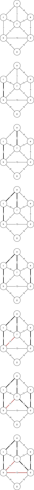

- $(b,c),(a,f),(a,c),(d,e),(d,f)$

b) Angiv sammenhængenskomponenterne som kanterne fra spørgsmål a giver anledning til, dvs. angiv sammenhængskomponenterne i grafen $G' = (V,A)$.

Hver sammenhængskomponent angives som en liste af knuder. I hver liste angiv endepunkterne i alfabetisk rækkefølge.

- $\{a,b,c,d,e,f\}$
- $\{g\}$

c) Angiv vægten af et minimum udspændende træ (MST) for hele grafen $G$.

- $2 + 3 + 5 + 8 + 12 + 15 = 45$

d) Vi antager nu at Kruskal bruger en disjoint-set datastruktur der er implementeret via en skov af træer som i lærebogens afsnit 21.3, under brug af både union-by-rank og path-compression heuristikken. Hvis der under Union laves et Link(x,y) på to knuder x og y med samme rank, antages det i dette spørgsmål at knuden med det alfabetisk mindste navn bliver den nye rod. Angiv udseendet af disjoint-set skoven efter at Kruskals algoritme har undersøgt 7 kanter. Hvert træ i skoven angives ved at skrive en liste af kanterne i det, samt hvilken knude som er roden. Angiv også rangen af roden.

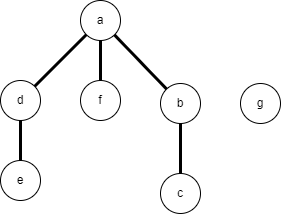

- Træ 1: $(a,b),(a,d),(a,f),(b,c),(d,e)$ - rod: a - rang: 2
- Træ 2: - rod: g - rang: 0

## B

### B1 Opgaver 5, 8 og 9 fra eksamenssættet fra juni 2014

Opg 5

Vi ønsker at bruge RADIX-SORT(A,4) til at sortere nedenstående array i stigende orden.

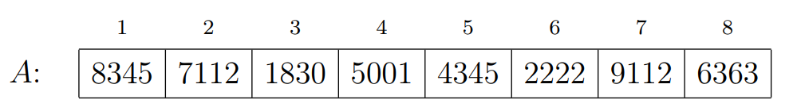

Vi indholdet af A efter udførelsen af tre af de fire iterationer i RADIX-SORT(A,4).

Svar ved at skrive indholdet af A i rækkefølge fra venstre mod højre.

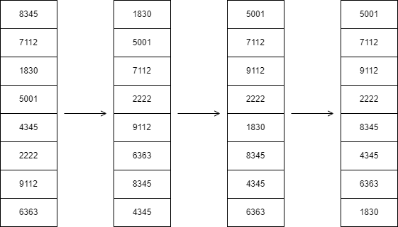

- $5001, 7112, 9112, 2222, 8345, 4345, 6363, 1830$

Opg 8

I denne opgave ser vi på at sortere n elementer efter værdien af deres nøgler, når det vides at disse nøgler kun antager værdierne 0 og 1.

Angiv for hver af algoritmerne CountingSort, InsertionSort, MergeSort og QuickSort, hvilke af nedenstående køretider som er henholdsvis deres worst-case og deres best-case køretid for denne type input.

A) $O(n)$

B) $O(n \log n)$

C) $O(n^2)$

Svar ved at angive indholdet (enten A, B eller C) af indgangene i følgende tabel:

- | Worst Case | Best Case
--- | --- | ---
COUTINGSORT | A | A
INSERTIONSORT | C | A
MERGESORT | B | B
QUICKSORT | C | C

Opg 9

Angiv for hver af følgende algoritmer deres asymptotiske køretid i O-notation som funktion af n.

```txt
ALGORITME1(n)
    s = 0               //1
    for i = 1 to n      //n
        for j = i to n  //n^2
            s = s + 1   //n^2
```

- $O(n^2)$

```txt
ALGORITME2(n)
    for i = 1 to n          //n
        s = n               //n
        while s > 1         //log n
            s = floor(s/2)  //log n
```

- $O(n \log n)$

```txt
ALGORITME3(n)
    s = 0                   //1
    for i = 1 to n          //n
        for j = i to n      //n^2
            for k = i to j  //n^3
                s = s + 1   //n^3
```

- $O(n^3)$

```txt
ALGORITME4(n)
    s = 0               //1
    while n > 1         //log n
        for i = 1 to n  //n / log n
            s = s + 1   //n / log n
        n = floor(n/2)  //log n
```

- $O(n)$

### B2 Eksamen juni 2012, opgave 2

a) Angiv hvilke af de fire arrays $A_1, A_2, A_3$ og $A_4$ som repræsenterer en min-heap.

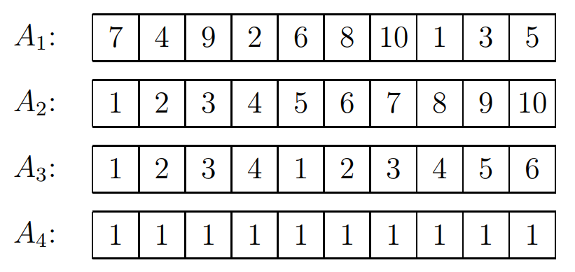

- $A_2$ og $A_4$

b) Angiv udseendet af min-heapen $A_5$ efter udførelse af en HEAP-EXTRACT-MIN opertaion. (Svar ved at skrive elementerne i rækkefølge fra venstre mod højre)

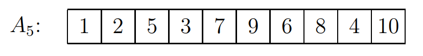

- $2,3,5,4,7,9,6,8,10$

### B3 Eksamen juni 2012, opgave 6

For $n \ge 1$ er heltalsalgoritmen værdien $\lfloor \log n \rfloor$. Dette er den største to-potens som ikke overstiger $n$ (dvs. er det heltal $k$ for hvilket $2^k \le n \le 2^{k+1}).

Man ser nemt følgende (som de kan bruge under begrundelse):

1) $\lfloor \log n/2 \rfloor = \lfloor \log n \rfloor - 1$

2) $\lfloor \log (n - 1) \rfloor = \lfloor \log n \rfloor$ når $n$ er et ulige heltal

Vi ønsker for et vilkåligt heltal $n \ge 1$ at beregne heltalsalgoritmen for $n$.

Betragt følgende algoritme til dette.

```INTERLOG(n)
    k = 0
    i = n
    while i > 1
        if i er et lige heltal
            i = i / 2
            k = k + 1
        else
            i = i - 1
    return k
```

a) Angiv værdierne af $i$ og $k$ ved hver test ved indgangen til while-løkken i overstående algoritme, når algoritmen køres med input $n = 53$.

1. k = 0, i = 53
2. k = 0, i = 52
3. k = 1, i = 26
4. k = 2, i = 13
5. k = 2, i = 12
6. k = 3, i = 6
7. k = 4, i = 3
8. k = 4, i = 2
9. k = 5, i = 1

b) Vis at følgend er en invariant for while-løkken, når algoritmen startes med input et heltal $n \ge 1$.

Når testen ved indgangen til while-løkken udføres gælder

i) $\lfloor \log i \rfloor + k = \lfloor \log n \rfloor$

ii) $i$ er et heltal

- i: $k = 0$ og $i = n$. $floor(log i) + k = floor(log n) + 0 = floor(log n)$
- ii: Hvis $n$ er et heltal, så stater $i$, som et heltal, derefter trækkes 1 fra hvis $k$ er et ulige tal og hvis $i$ er et lige tal bliver det delt med 2, hvilet resultere i et heltal.

c) Argumenter for at algoritmen er korrekt, dvs. at den for alle heltal $n \ge 1$ stander og returnerer $\lfloor \log n \rfloor$

- Algoritmen returnere efter while-løkken stopper, under while-løkken gælder at $\lfloor \log i \rfloor + k = \lfloor \log n \rfloor$. $\lfloor \log i \rfloor$, vil tilsidst være 0, det vil altså sige at algoritmen returnerer $k = \lfloor \log n \rfloor$.

d) Giv en analyse af den asymptotiske køretid (som funktions af $n$) for algoritmen.

- Når $i$ er lige bliver den halveret, så vil køretiden være $O(\log n)$
- Når $i$ er ulige bliver den 1 mindre, det vil højst være $\Omega(\log n)$
- Fordi vi både har $O$ og $\Omega$ bliver den samlede køretid $\Theta(\log n)$
