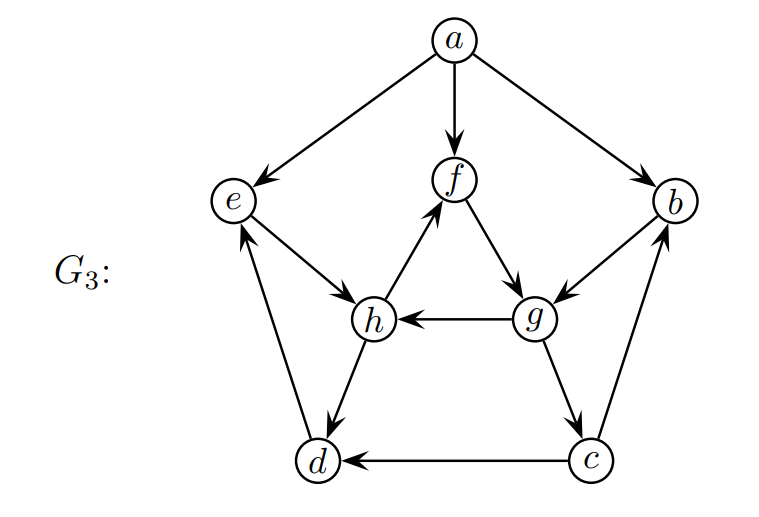
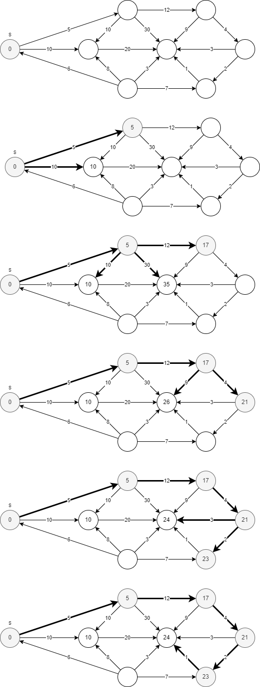
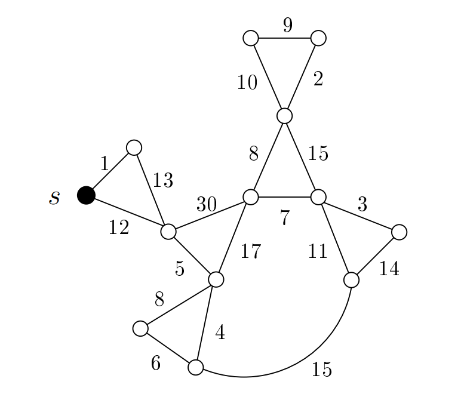

# L15 Uge 19

## A

### A1 Cormen et al. øvelse 24.1-1 (side 654). Blot den første halvdel af opgaven

Run the Bellman-Ford algorithm on the directed graph of Figure 24.4, using vertex $z$ as the source. In each pass, relax edges in the same order as in the figure, and show the $D$ and $\pi$ values after each pass. Now, change the weight of edge $(z,x)$ to 4 and run the algorithm again, using s as the source.


### A2. Eksamen juni 2012, opgave 4, dog ikke spørgsmål b

a) For alle knuder $v = a,b,..,h$ i grafen $G_1$, angiv værdien $v.d$ der beregnes af Bellman-Fords algoritme, når den køres for at finde distancen fra knuden $a$ til all andre knuder.


- $a.d = 0; b.d = 17; c.d = 9; d.d = 1; e.d = 7; f.d = -10; g.d = 12; h.d = 0$

c) For alle knuder $v = a,b,...,h$ i grafen $G_3$, angiv starttiden (discovery time) $v.d$ og sluttiden (finishing time) $v.f$ som tildeles ved dybde-først søgning (DFS) med start i knuden $a$.

For DFS afhænger resultatet af ordningen af knuders naboliste. Du skal har antage at på figuren er en knudes naboliste sorteret i alfabetisk orden efter naboknuderenes navne.




- $a.d = 0; a.f = 16; b.d = 2; b.f = 15; c.d = 4; c.f = 13; d.d. = 5; d.f = 12; e.d = 6; e.f = 11; f.d = 8; f.f = 9; g.d = 3; g.f = 14; h.d = 7; h.f = 10$

### A3. Eksamen juni 2010, opgave 2, spørgsmål c

For all knuder $v$ i grafen $G_3$, angiv distanceværdien $v.d$ som tildeles ved kørsel af Dijkstras algoritme med start i knuden $s$.




### A4. Eksamen januar 2008, opgave 2, spørgsmål c. Hint: du skal bruge Dijkstras algoritme. Der spørges om v.π-værdierne. Giv også v.d værdierne

Vi ser igen på den samme graf som i sprøgsmål b (se neden for). Tegn et korteste-vej-træ med rod i den sorte knude $s$. Dvs. tegn de korteste veje fra $s$ til hver af de andre knuder i grafen.

Du kan evt. bruge tegningen på sidste side.

Husk at argumentere for at dit resultat er rigtigt.




### A5. Cormen et al. øvelse 24.2-1 (side 657)

Run DAG-SHORTEST-PATHS on the directed graph of Figure 24.5, using vertex r
as the source


### A6. Eksamen juni 2011, opgave 4

I denne opgave ser vi på tre forskellige slgoritmer anvendt på hver af de fra vægtede grafter i figur 4. Som sædvanligt er længden af en vej i en vægtet graf summen af vægtene på kanterne i vejen.


a) For hvilke af de tre grafer i figur 4 kan man bruge Bredde-Først-Søgning til at beregne den korteste afsand fra $s$ til $t$?

- $G_1$

- BFS tæller blot kanter.

b) For hvilke af de tre grafer i figur 4 kan man bruge DAG-SHORTEST-PATHS til at beregne den korteste afstand fra $s$ til $t$?

- $G_1$ og $G_3$

- Dag-Shortest-Paths fungerer på acykliske grafer.

c) For hvilke af de tre grafer i figur 4 kan man bruge Dijkstras Algoritme til at beregne den korteste afstand fra $s$ til $t$?

- $G_1$ og $G_2$

- Dijkstras algoritme virker korrekt på grafer uden negative vægte.

### A7. Eksamen juni 2014, opgave 10

En kvadrat-graf er en orienteret graf med $k$ rækker, hver med $k$ knuder, og med knater som illustreret i figuren nedenfor (for $k = 5$).


Mere præcist har en kvadrat-graf knuder $v_{i,j}$ for $i = 1, 2,..., k$ (rækkenummer) of $j = 1, 2,..., k$ (søjlenummer), samt kanter $(v_{i,j},v_{i+1,j}),(v_{i,j},v_{i,j+1})$ og $(v_{i,j},v_{i,j-1})$ for alle værdier af $i,j$ for hvilke begge kanters knuder eksisterer.

I resten af denne opgave antager vi at alle kanter i en kvadrat-graf har en ikke-negativ vægt.

a) Lad $n$ og $m$ betegne henholdvis antal knuder og antal kanter i en kvardrat-graf. Udtrak $n$ og $m$ som funktion af $k$.

$n = k^2$

$m = 3(k^2 - k)$

b) Angiv udførselstiden for Dijkstra's Algoritme som funktion af $k$ når den udføres på en kvadrat-graf med start i knuden $v_{1,1}$.

- $k^2$ knuder
- $\log k$ høj

- $O(k^2 \log k)$

c) Konstruér en algoritme som i tid $O(m)$ finder længden af de korteste veje fra knuden $v_{1,1}$ til alle øvrige knuder i en kvadrat-graf. Beskriv (i ord eller pseudokode) algoritmen, og argumenter for algoritmens køretid og korrekthed.

Hint: Lemma 24.15 (side 673) fra lærebogen kan være inspirerende.

- Det er muligt at komme fra $v_{1,1}$ til alle andre knuder ved blot at gå op og til højre

```txt
  //Initialiser
  for i = 1 to k:
    for j = 1 to k:
      v.d = infinity
  v_{1,1}.d = 0

  // relax højrevendte kanter i lag 1, fra venstre mod h�jre 
  for j = 1 to k-1:
    relax(v{1,j},v_{1,j+1})

  // for alle lag i >= 2
  for i = 2 to k:
    // relax opvendte kanter fra lag i-1 til lag i
    for j = 1 to k:
      relax(v{i-1,j},v_{i,j})
    // relax højrevendte kanter i lag i, fra venstre mod højre 
    for j = 1 to k-1:
      relax(v{i,j},v_{i,j+1})
    // relax venstrevendte kanter i lag i, fra højre mod venstre
    for j = 1 to k-1:
      relax(v{i,k-j+1},v_{i,k-j})
```
