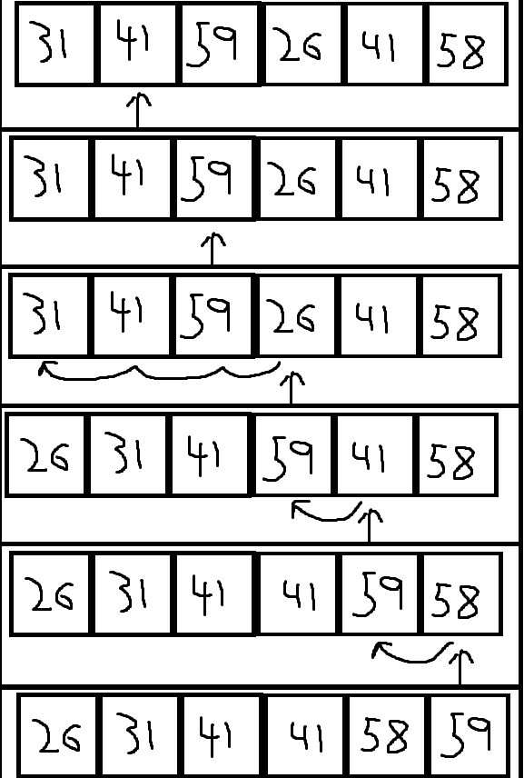
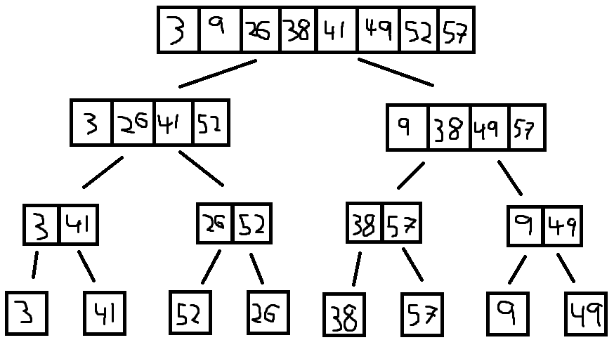

# L2 Uge 6

# A

## 1 (Cormen et al. exercie 2.2-3 side 29)

Consider linear search again (see Exercise 2.1-3). How many elements of the input sequence need to be checked on the average, assuming that the element being
searched for is equally likely to be any element in the array? How about in the
worst case? What are the average-case and worst-case running times of linear
search in ‚$\Theta$-notation? Justify your answers.

- Best case: 
  - To find the element with index 0
  - $c \cdot 1$
- Worst case:
  - Element is last or not found
  - $c \cdot n$
- Avg case:
  - $\frac{c \cdot n}{2}$

## 2 (Cormen et al. exercie 2.1-1 side 22)

Using Figure 2.2 as a model, illustrate the operation of INSERTION-SORT on the
array $A = \{31, 41, 59, 26, 41, 58\}$.



## 3 
Implementer InsertionSort i Java eller Python ud fra pseudo-koden
side 18 i lærebogen. Test at din kode fungerer ved at generere arrays/lister med forskelligt indhold og sortere dem. NB: Bogens pseudokode indekserer arrays startende med index 1, mens Java og Python
starter med index 0. Man må derfor ændre passende (dvs. nogle gange bruge et index som er ´en mindre) i de linier i pseudokoden, som
involverer indekser.

[java](./java/L2.java)

## 4 (Cormen et al. problem 2-4 side 41)

Let $A[1..n]$ be an array of $n$ distinct numbers. If $i < j$ and $A[i] > A[j]$, then the
pair $(i,j)$ is called an inversion of A.

a) List the five inversions of the array $\{2,3,8,6,1\}$ 

- $(5,4),(5,3),(5,2),(5,1),(4,3)$

b) What array with elements from the set $\{1,2,..,n\}$ has the most inversions?
How many does it have?

- An array with $n$ element in revese order would have $\sum_{i=1}^{i=n-1}i$ inversions
 
c) What is the relationship between the running time of insertion sort and the
number of inversions in the input array? Justify your answer

- More inversions mean longer run time. Inversions measure how out of place a number is, and the futher out of place a number is, the more operations is needed to bring it to its correct place.

## 5 (Cormen et al. problem 2.3-1 side 37)

Using Figure 2.4 as a model, illustrate the operation of merge sort on the array
$A = \{3,41,52,26,38,57,9,49\}$.



## 6 (Cormen et al. exercie 2.3-2 side 37)

Rewrite the MERGE procedure so that it does not use sentinels, instead stopping
once either array L or R has had all its elements copied back to A and then copying
the remainder of the other array back into A

[java](java/L2.java)

## 7

Vis for

$$f(n) = 0.1 \cdot n^2 + 5 \cdot n + 25$$

at $f(n) = \Theta(n^2) og f(n) = o(n^3)$. 

Hint: brug sætninger fra side 17 i slides om analyse af algoritmers køretider.

$$f(n)= \Theta (n^2) = \frac{0.1 \cdot n^2 + 5 \cdot n + 25}{n^2} \rightarrow \frac{0.1 + \frac{5}{n} + \frac{25}{n^2}}{1} = 0.1 \space for \space n \rightarrow \infin$$

$$f(n)= o (n^3) = \frac{0.1 \cdot n^2 + 5 \cdot n + 25}{n^3} \rightarrow \frac{\frac{0.1}{n} + \frac{5}{n^2} + \frac{25}{n^3}}{1} = 0 \space for \space n \rightarrow \infin$$

## 8

Vis at følgende funktioner er skrevet op efter stigende asymptotisk
voksehastighed:

$$1, \log n, \sqrt{n}, n, n \log n, n\sqrt{n}, n^2, n^3, n^{10}, 2^n$$

Mere præcist, vis at det for alle par $f(n)$, $g(n)$ af naboer i listen gælder
at $f(n) = o(g(n))$. Hint: brug sætninger fra side 17 (og 18 og 19) i slides
om analyse af algoritmers køretider.

$$\frac{1}{\log{n}} = \frac{\frac{1}{\log{n}}}{1} \rightarrow \frac{0}{1} \rightarrow 0 \space for \space n \rightarrow \infin \Rightarrow 1 = o(\log n)$$

$$\frac{\log{n}}{\sqrt{n}} = \frac{\frac{\log{n}}{\sqrt{n}}}{1} \rightarrow \frac{0}{1} \rightarrow 0 \space for \space n \rightarrow \infin \Rightarrow \log n = o(\sqrt n)$$

$$\frac{\sqrt{n}}{n} = \frac{\frac{\sqrt{n}}{n}}{1} \rightarrow \frac{0}{1} \rightarrow 0 \space for \space n \rightarrow \infin \Rightarrow \sqrt n = o(n)$$

$$\frac{n}{n \log n} = \frac{\frac{1}{\log n}}{1} \rightarrow \frac{0}{1} \rightarrow 0 \space for \space n \rightarrow \infin \Rightarrow n \log n = o(n)$$

$$\frac{n \log n}{n \sqrt n} = \frac{\frac{ \log n}{ \sqrt n}}{1} \rightarrow \frac{0}{1} \rightarrow 0 \space for \space n \rightarrow \infin \Rightarrow n \sqrt n = o(n \log n)$$

$$\frac{n \sqrt n}{n^2} = \frac{\frac{ \sqrt n}{n}}{1} \rightarrow \frac{0}{1} \rightarrow 0 \space for \space n \rightarrow \infin \Rightarrow n^2 = o(n \sqrt n)$$

$$\frac{n^2}{n^3} = \frac{\frac{1}{n}}{1} \rightarrow \frac{0}{1} \rightarrow 0 \space for \space n \rightarrow \infin \Rightarrow n^3 = o(n^2)$$

$$\frac{n^3}{n^{10}} = \frac{\frac{1}{n^7}}{1} \rightarrow \frac{0}{1} \rightarrow 0 \space for \space n \rightarrow \infin \Rightarrow n^{10} = o(n^3)$$

$$\frac{n^{10}}{2^n} = \frac{\frac{n^{10}}{2^n}}{1} \rightarrow \frac{0}{1} \rightarrow 0 \space for \space n \rightarrow \infin \Rightarrow 2^n = o(n^{10})$$

## 9 (Cormen et al. exerice 3.1-1 side 52)

Let $f(n)$ and $g(n)$ be asymptotically nonnegative functions. Using the basic definition of ‚$\Theta$-notation, prove that $max(f(n),g(n))=\Theta(f(n)+g(n))$.

We know that:
$$f(n) \le f(n) + g(n)$$
$$g(n) \le f(n) + g(n)$$

So we can conclude:
$$max(f(n),g(n)) = O (f(n) + g(n))$$

We also know that:
$$f(n) \le max(f(n),g(n))$$
$$g(n) \le max(f(n),g(n))$$
$$f(n) + g(n) \le 2 max(f(n),g(n))$$

So we can conclude:
$$max(f(n),g(n)) = \Omega (f(n) + g(n))$$

Because of this we get that:
$$max(f(n),g(n))=\Theta(f(n)+g(n))$$

# B

## 1

Fortsæt opgaven ovenfor med implementation af InsertionSort på denne måde:
Tilføj tidtagning af din kode ved at indsættte to kald til metoden
`System.currentTimeMillis()` for Java eller `time.time()` for Python. Indsæt ét i starten af InsertionSort og ét i slutningen (slå funktionaliteten af metoden op i Javas/Pythons online dokumentation og
se kodeeksemplerne fra forelæsningne i denne uge). Der skal kun tages
tid på selve sorteringen, ikke den del af programmet som genererer
array’ets/listens indhold.
Kør din kode dels med sorteret input (best case for InsertionSort), dels
med omvendt sorteret input (worst case for InsertionSort). Gør dette
for mindst 5 forskellige værdier af n (antal elementer at sortere). Vælg
disse værdier af $n$ så de får programmet til at bruge fra ca. 100 til
ca. 5000 millisekunder (værdierne er ikke de samme for best case og
worst case). Gentag hver enkelt kørsel tre gange og find gennemsnittet af antal millisekunder brugt ved de tre kørsler (fluktuationer fra
baggrundsprocesser får derved mindre indflydelse). Diviéer de fremkomne tal med henholdsvis $n$ (for best case input) og $n^2$ (for worst case input), og check derved hvor godt analysen passer med praksis – de resulterende tal burde ifølge analysen være konstante (for best case
tallene og for worst case tallene, hver for sig), jvf. graferne på slides fra forelæsningen.
Kør derefter din kode med input, som er random int’s. I Java, brug
f.eks. et java.util.Random objekt og dets metode nextInt() til at
generere dem. I Python, brug f.eks. random.randint() til at generere
dem. Er køretiderne tættest på best case eller worst case?

- To get best case to use over 100ms: $n \le 100000000$ 
- To get worst case to use over 100ms: $n \le 10000$
- When using random lists the time is closer to the worst case

## 2 (Cormen et al. exercise 2.3-7 side 39) 

Hint: start med at sortere tallene. Du må gerne bruge at dette kan gøres i $O(n \log n$) tid (f.eks. med Mergesort).

```
SUM_OF_TWO(A,x)
  MERGE-SORT(A)

  let i = 1, and j = A.lenght
  While(i<j)
    if A[i] + A[j] < x
      i = i + 1
    else if A[i] + A[j] > x
      j = j - 1
    else
      return i and j
```

## 3 (Cormen et al. exercise 2.3-5 side 39)

Udvid opgaven således: Start
med at illustrere algoritmen med en tegning. Lav derefter pseudokode
for algoritmen (som i opgaveteksten). Lav derefter et program i Java
eller Python på basis af din pseudokode. Test til sidst korrekthed af
din implementation ved at generere arrays (Java) eller lister (Python)
med indholdet 1,3,5,7,. . . . og derefter udføre søgninger. Test med både
3
tomme arrays/lister, lange arrays/lister, og søgning både efter tal, som
er der, og efter tal, som ikke er der. Husk: lad være med at snyde (dig
selv og din egen læring) ved at se på kode fra nettet eller andre steder.

```
BINARY-SEARCH(A,left,right,value) // A must be sorted
  let middle be (left + right) / 2
  if A[middle] = v
    return midt
  else if A[midt] < v
    BINARY-SEARCH(A,left,middle,value)
  else
    BINARY-SEARCH(A,middle,right,velue)
```

If we think of binary-search as working backwards from merge-sort we end up with the same amount of layers, that we then have to search. The amount of layers are at most $\log n$, so from this we get that the worst case for binary-search is $\Theta (\log n)$

## 4 (Cormen et al. exercise 2.3-6 side 39)

Can we use binary-search to optimize insertion-sort: Yes, the only requirement for binary-search is that the Array/list must be sorted, and the while loop works on a sorted sub-Array/list. For this to work the binary-search has to be iterative and not recursive.

```
INERTION-SORT(A)
  for j = 2 to A.length
      let key = A[j]
      let i = j - 1
      let location = BINARY-SEARCH(A, 0, i, key)
      while i > location
          A[i + 1] = A [i]
          i = i - 1
      A[i + 1] = key
```

```
BINARY-SEARCH(A, left, right, value)
  while left <= right
    let middle = left + (right - left) / 2
    if A[middle] = value
      return middle
    else if A[middle] > value
      right = middle -1
    else
      left = middle + 1
```

## 5 (Cormen et al. exercise 3.1-4 side 53)

Hint: husk regneregler for potenser
(kan genopfriskes på side 55 midt).

Is $2^{n+1} = O(2^n)$

If we can find a $c$ and $k$ such that $k(2^{n+1}) \le c(2^n)$, then the above statment is true.

$$O(g(n)) = \{f(n): \exists c \in \real^+ \exists k \in \real^+ \forall n, n \ge k (0 \le f(n) \le cg(n))\}$$

Note: $2^{n+1} = 2(2^n)$

So if: $c \ge 2$ and $k \le \frac{c}{2}$ then $2^{n+1} = O(2^n)$

Is $2^{2n} = O(2^n)$

If we can find a $c$ and $k$ such that $k(2^{n+1}) \le c(2^n)$, then the above statment is true.

$$O(g(n)) = \{f(n): \exists c \in \real^+ \exists k \in \real^+ \forall n, n \ge k (0 \le f(n) \le cg(n))\}$$

Note: $2^{2n} = (2^n)^2 = 2^n 2^n$

So if: $c \ge 2^n$ and $k \le \frac{c}{2^n}$ then $2^{2n} = O(2^n)$

## 6 (Cormen et al. exercise 3.2-3 side 60)

Hint: for at vise formel (3.19)
side 58 kan man godt bruge Stirlings formel (3.18) side 57, sådan som
bogen foreslår i tekst ved (3.19), men jeg vil foreslå at argumentere
langt mere jordnært ud fra definitionen af n!. Husk regnereglerne for
logaritmer (se side 56 nederst, specielt anden regel).

Prove: $\log(n!)=\Theta(n \log(n))$

$$\log n! = \log 1 + \log 2 + ... + \log (n-1) + \log n$$
$$n \log n = \log n + \log n + ... + \log n + \log n$$
$$\log n! \le n \log n$$
So:
$$\log n! = O(n \log n)$$

---
$$(n!)^2 = n + 2(n-1) + 3(n-2) + ... + (n-2)3 + (n-1)2 + n$$
$$=\prod _{k=1} ^n (n-k+1)k$$
$$=\prod _{k=1} ^n (-k^2+kn+k)$$
The min for the function:
$$-(1^2)+n+1=n$$
$$(n!)^2 \ge \prod _{k=1} ^n n = n^n$$
$$\log((n!)^2) \ge \log (n^n)$$
$$2 \log n! \ge n \log n$$
$$\log n! \ge \frac{1}{2} n \log n$$
So:
$$\log n! = \Omega(n \log n)$$
---
$$\log n! = O(n \log n) \land \log n! = \Omega(n \log n) \Rightarrow \log n! = \Theta(n \log n)$$

Prove: $n!=\omega(2^n)$

$$n! = n \cdot (n-1) \cdot ... \cdot 2 \cdot 1$$
$$2^n = 2 \cdot 2 \cdot ... \cdot 2 \cdot 2$$
For every term, except for $1$, we can see $n! \ge 2^n$

$$n! > 2^n$$
So:
$$n!=\omega(2^n)$$

Prove: $n!=o(n^n)$

$$n! = n \cdot (n-1) \cdot ... \cdot 2 \cdot 1$$
$$n^n = n \cdot n \cdot ... \cdot n \cdot n$$
For every term, we can see $n! \le n^n$

$$n! < 2^n$$
So:
$$n!=o(n^n)$$