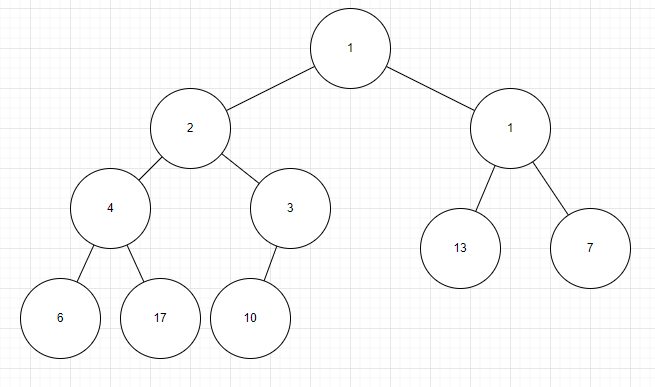

# L4 Uge 8

# A

## 1 (Cormen et al. exercise 7.1-1 side 173)

Using Figure 7.1 as a model, illustrate the operation of PARTITION on the array
$A = \{13,19,9,5,12,8,7,4,21,2,6,11\}$


## 2 (Cormen et al. exercise 7.1-2 side 174)

What value of $q$ does PARTITION return when all elements in the array $A[p..r]$
have the same value? Modify PARTITION so that $q = \lfloor (p+r)/2 \rfloor$ when all
elements in the array $A[p..r]$ have the same value

- If all values are the same the return is $r$

- To make the algorithm return the midtpoint $((p+r)/2)$, we can make it skip every other value like this:

```
PARTITION(A,p,r)
    x = A[r]
    i = p - 1
    for j = p to r - 1
        if A[j] <= x and j mod 2 = (p + 1) mod 2
            i = i + 1
            exchange A[i] with A[j]
    exchange A[i + 1] with A[r]
    return i + 1
```

## 3 (Cormen et al. exercise 7.2-2 side 178)

What is the running time of QUICKSORT when all elements of array A have the
same value?

- The running time is $n^2$, each time PARTITION is run, wich take $n$ time, it returns the last position, so not much progress has been made, and this happens $n$ time.

## 4 (Cormen et al. exercise 7.2-3 side 178)

Show that the running time of QUICKSORT is $\Theta(n^2)$ when the array A contains
distinct elements and is sorted in decreasing order.

- When we run PARTITION the pivot element is going to be less than all other elements, so the darkgrey area is increasing in size every step in PARTITION, wich takes $n$ time.
- Each time PARTITION has been run the subproblem has only decreased by $n-1$, and this happens $n$ times, wich in total gives $\Theta(n^2)$

- The same would happen for an array in ascending  order, PARTITION is not well equiped for these situations.

## 5 Eksamen juni 2008, opgave 1 b

Angiv best-case og worst-case køretid samt køretiden
for sorteret input for Insertion Sort, Merge Sort og Quicksort

 x | Best-case | Worst-case | Sorted input 
---|---|---|---
Insertion sort | $n$ | $n^2$ | $n$
Reason | A sorted input where no work has to be done | An array in reverse order | No work, just loop over the every element of the array
Merge sort | $n \log n$ | $n \log n$ | $n \log n$
Reason | It will always work $n$ over $\log n$ layers | <- | <--
Quick sort | $n \log n$ | $n^2$ | $n^2$
Reason | If PARTITION finds good pivot element its total work will be $n$ and result in $\log n$ layers | A sorted array results in PARTITION duing littl work each time | <-

## 6 (Cormen et al. problem 7-2, question b side 186)

The PARTITION procedure returns an index $q$ such that each element of
$A[p..q-1]$ is less than or equal to $A[q]$ and each element of $A[q+1..r]$
is greater than $A[q]$. Modify the PARTITION procedure to produce a procedure
PARTITION'
($A,p,r$), which permutes the elements of $A[p..r]$ and returns two
indices $q$ and $t$, where $p \le q \le t \le r$, such that

- all elements if $A[q..t]$ are equal
- each element of $A[p..q-1]$ is less than $A[q]$, and
- each element of $A[t+1..r]$ is greater than $A[q]$

```
PARTITION(A,p,r)
    x = A[r]
    exchange A[r] with A[p]
    i = p - 1
    k = p
    for j = p + 1 to r - 1
        if A[j] < x
            i = i + 1
            k = i + 2
            exchange A[i] with A[j]
            exchange A[k] with A[j]
        else if A[j] = x
            k = k + 1
            exchange A[k] with A[j]
    exchange A[i + 1] with A[r]
    return i + 1 and k + 1
```

## 7 (Cormen et al. exercise 6.1-5 side 154)

Is an array that is in sorted order a min-heap?

- Yes, as the index of the array(and heap) increases so does the value of what is stored at that index, so the lowest value is at the root and the highest values is in the leaves

## 8 (Cormen et al. exercise 6.1-6 side 154)

Is the array with values $\{23,17,14,6,13,12,1,5,7,12\}$ a max-heap?

- No, index 9 (7) is greater than its parren, index 4 (5), and should be swapped

## 9 Eksamen januar 2008, opgave 1 b

Indsæt nøglen $9$ i den binære max-hob repræsenteret
ved nedenstående array.

$10,8,6,3,7,4,5,1,2,-$

Vis resultatet før hvert gennemløb af while-løkken i algoritmen på s. 164 i
lærebogen.

Du må gerne tegne det som en træstruktur i stedet for et array

$10,8,6,3,7,4,5,1,2,9$

- $9$ is at index $10$, so its parrent is $7$ at index $5$. $9 > 7$, so we swap them

$10,8,6,3,9,4,5,1,2,7$

- $9$ is at index $5$, so its parrent is $8$ at index $2$. $9 > 8$, so we swap then

$10,9,6,3,8,4,5,1,2,7$

- Now the array is in max-heap form

## 10 Eksamen januar 2006, opgave 1 b

Betragt følgende binære hob (binary heap)


Nu indsættes et element med prioritet 2. Tegn hoben, som den ser ud efter
denne indsættelse




## 11 (Cormen et al. exercise 6.2-1 side 156)

Using Figure 6.2 as a model, illustrate the operation of MAX-HEAPIFY($A, 3$) on
the array $A = \{27, 17, 3, 16, 13, 10, 1, 5, 7, 12, 4, 8, 9, 0\}$.


## 12 

Udfør Heap-Extract-Max(A) på nedenstående max-heap A.

$A = \{21,18,10,12,8,9,4,7,5,2\}$

- Remove $21$

$-,18,10,12,8,9,4,7,5,2$

- Move last ($2$) to root

$2,18,10,12,8,9,4,7,5$

- Both of $2$'s children are bigger than is, and $18 > 10$, so $18$ and $2$ swap

$18,2,10,12,8,9,4,7,5$

- Now we see that $2$'s new children, $12$ and $8$, are both bigger than it, and $12 > 8$, so $12$ and $2$ swap

$18,12,10,2,8,9,4,7,5$

- Again we see that $2$'s new children, $7$ and $5$, are both bigger than it, and $7 > 5$, so $7$ and $2$ swap

$18,12,10,7,8,9,4,2,5$

- And that is the new max-heap

## 13 (Cormen et al. exercise 6.1-4 side 154)

Where in a max-heap might the smallest element reside, assuming that all elements
are distinct?

- The smallest element could be at any leaf-node


# B


## 1

[java](./java/L4.java)

## 2 Eksamen juni 2008, opgave 4 a.

Tegn alle mulige binære min-hobe, som indeholder fire
knuder med prioriteterne 1, 2, 3 og 4.


## 3 (Cormen et al. exercise 6.5-9 side 166)

Give an $O(n \log k)$-time algorithm to merge $k$ sorted lists into one sorted list,
where $n$ is the total number of elements in all the input lists. (Hint: Use a minheap for k-way merging.)

- First make a min-heap with the starting element of each list
- Then extract the smallest element from the min-heap, $O(\log k)$ to restore min-heap
- Now take the next element from the list where the smallest element was originally from, $O(\log k)$ to insert the new element in the heap
- Repeat untill all list are empty
- And because we have a total of $n$ element, the total amount of steps are $O(n \log k)$

## 4

Bevis at de beregnede indekser i Parent, Left og Right p˚a
side 152 er korrekte

- Grundet at et heap vokser med en faktor på 2 for hvert lag, så vil hver knude i et lag skulle være forældre til to knuder i laget under.
- Ud fra dette får vi at en knudes børn vil være $2i$ og $2i + 1$
- Ligeså kan vi sige at to knuder deles om en forældre, og med det en kundes forældre kunde kan findes ved $\lfloor i/2 \rfloor$

## 5 (Cormen et al. problem 6.2 side 167)

A d-ary heap is like a binary heap, but (with one possible exception) non-leaf
nodes have d children instead of 2 children.

A) How would you represent a d-ary heap in an array?

- We just need a way to find the children and parrent of a node.
- To find the parrent: $\lfloor i / d \rfloor$
- To find the children we need a function: 
```
Child(n,i)
    return di - d + k + 1
```

B) What is the height of a d-ary heap of n elements in terms of n and d?

- The height is $\log_d (n) + 1$

C) Give an efficient omplementation of EXTRACT-MAX in d-ary max-heap. Analyze its running time in terms of d and n.

```
D-EXTRACT-MAX(A)
    max = A[1]
    A[1] = A[A.size]
    A.size = A.size - 1
    D-MAX-HEAPIFY(A,1)

D-MAX-HEAPIFY(A,i)
    max = i
    for k = 1 to d
        if CHILD(k,i) <= A.size and A[CHILD(k,i)] > A[i]
            if A[CHILD(k,i)] > max
                max = A[CHILD(k,i)]
    if max =/= i
        exchange A[i] with A[max]
        D-MAX-HEAPIFY(A,max)
```

- The amount of times the D-MAX-HEAPIFY calles it self is bounded by the amount of layers $d$
- So in total the time is $O(d \log_d n)$


D) Give an effcicent implementation of INSERT in a d-ary max-heap. Analyze its running time in terms of d and n.

```
D-INSERT(A,key)
    A.size = A.size + 1
    A[A.size] = key
    while i > 1 and A[PARRENT(i)] < A[i]
        exchange A[PARRENT(i)] with A[i]
        i = PARRENT(i)
```

- First increase the size of the heap, and place the new element at the end
- Then move from the bottom up while the child is bigger than its parrent 

- The running time of this is $O(\log_d n)$, because the while loop can at most run the height of the heap

E) Give en effcient implementation of INCREASE-KEY(A,i,k), which flags an error if k < A[i], but otherwise sets A[i] = k and then updates the d-ary max-heap structure appropriatly. Analyse its running time in terms of d and n.

```
D-INCREASE-KAY(A,i,key)
    if key < A[i]
        error
    A[i] = key
    while i > 1 and A[PARRENT(i)] < A[i]
        exchange A[PARRENT(i)] with A[i]
        i = PARRENT(i)

```

- This has the same running time as E, $O(\log_d n)$