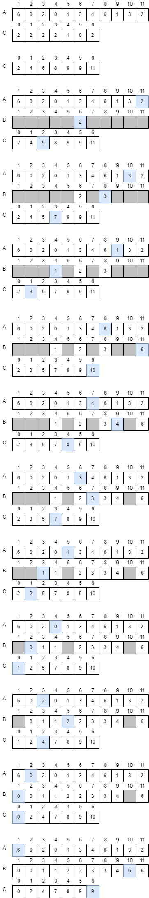
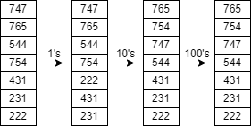
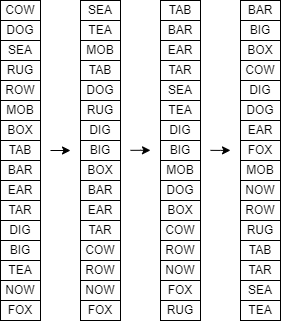

# L5 Uge 9

## A

### A1 (Cormen et al. exercise 6.4-4 side 160)

Show that the worst-case running time of HEAPSORT is $\Omega (n \log n)$

- If the array already is sorted, then we first have to convert it to a MAX-HEAP, which take $n$ time
- Then it takes $n \log n$ time to sort from the heap.
- So the dominant part is $n \log n$

### A2 (Cormen et al. exercise 8.2-1 side 196)

Using Figure 8.2 as a model, illustrate the operation of COUNTING-SORT on the
array $A = \{6, 0, 2, 0, 1, 3, 4, 6, 1, 3, 2\}$.



### A3 (Cormen et al. exercise 8.2-3 side 196)

Suppose that we were to rewrite the for loop header in line 10 of the COUNTINGSORT as

```text
10  for j = 1 to A.length
```

Show that the algorithm still works properly. Is the modified algorithm stable?

```text
COUNTING-SORT(A,B,k)
    for i = 0 to k
        C[i] = 0
    for j = 1 to A.length
        C[A[j]]++
    for i = 1 to k
        C[i] = C[i] + C [i - 1]
    for j = 1 to A.length
        B[C[A[j]]] = A[j]
        C[A[j]] = C[A[j]] - 1
```

- It will still work, but it is not stable anymore
- If there are two element that are equal, they will be in reverse order

### A4 (Cormen et al. exercise 8.2-4 side 197)

Describe an algorithm that, given n integers in the range 0 to k, preprocesses its
input and then answers any query about how many of the n integers fall into a
range $[a..b]$ in $O(1)$ time. Your algorithm should use $\Theta(n + k)$ preprocessing
time.

- For the preprossing we just use the first part of counting-sort, where the C-array is made, this takes $\Theta(n + k)$ time.
- Then when we want to get a range, we can index into the C-array, with `C[b] - C[a-1]`. Indexing in an array is constant time, $O(1)$

### A5 (Cormen et al. exercise 8.3-2 side 200)

Which of the following sorting algorithms are stable: insertion sort, merge sort,
heapsort, and quicksort? Give a simple scheme that makes any sorting algorithm
stable. How much additional time and space does your scheme entail?

- Insertion sort is stable
- Merge sort is stable
- Heap sort is not stable
- Quick sort is not stable

- If be want to make any sorting algorithm stable, we can keep track of their initial index, and make sure that equal element are sorted be thier initial index, this will take $\Theta(n)$ more space since we need as much space as the original array.

### A6 Eksamen juni 2008, opgave 1a

Udfør radix sort med radix 10 på tallene

$747, 765, 544, 754, 431, 231, 222$

Vis resultatet efter hver iteration



### A7 (Cormen et al. exercise 8.3-4 side 200)

Show how to sort $n$ integers in the range 0 to $n^3 - 1$ in $O(n)$ time

- If we convert the numbers to base n, this results the numbers at most has 3 digits
- Then we radix sort, this will be done 3 times, each run takes O(n) time, so in total it takes O(n) time.

## B

### B1 (Cormen et al. exercise 8.3-1 side 199)

Using Figure 8.3 as a model, illustrate the operation of RADIX-SORT on the following list of English words: COW, DOG, SEA, RUG, ROW, MOB, BOX, TAB,
BAR, EAR, TAR, DIG, BIG, TEA, NOW, FOX



### B2 (Cormen et al. problem 7-4 side 188)

Stack depth for quicksort

The QUICKSORT algorithm of Section 7.1 contains two recursive calls to itself.
After QUICKSORT calls PARTITION, it recursively sorts the left subarray and then
it recursively sorts the right subarray. The second recursive call in QUICKSORT
is not really necessary; we can avoid it by using an iterative control structure.
This technique, called tail recursion, is provided automatically by good compilers.
Consider the following version of quicksort, which simulates tail recursion:

```text
TAIL-RECURSIVE-QUICKSORT(A,p,r)
    while p < r
        q = PARTITION(A,p,r)
        TAIL-RECURSIVE-QUICKSORT(A,p,q-1)
        p = q + 1
```

a. Argue that TAIL-RECURSIVE-QUICKSORT(A,1,A.length) correctly sorts the array A.

- Since the only differnce between TAIL-RECURSIVE-QUICKSORT and QUICKSORT is the last line, we know that TAIL-RECURSIVE-QUICKSORT will sort an array correctly.

Compilers usually execute recursive procedures by using a stack that contains pertinent information, including the parameter values, for each recursive call. The
information for the most recent call is at the top of the stack, and the information
for the initial call is at the bottom. Upon calling a procedure, its information is
pushed onto the stack; when it terminates, its information is popped. Since we
assume that array parameters are represented by pointers, the information for each
procedure call on the stack requires O.1/ stack space. The stack depth is the maximum amount of stack space used at any time during a computation

b. Describe a scenario in which TAIL-RECURSIVE-QUICKSORT's stack depth is $\Theta(n)$ on an $n$-element input array.

- If the input is sorted, then the PARTITION will result in one half will be 0, so there will be $n-1$ recursive calls, before the while loop breaks.

c. Modify the code for TAIL-RECURSIVE-QUICKSORT so that the worst-case stack depth is $\Theta (\log n)$. Maintain the $O(n \log n)$ expected running time of the alorithm.

- We need to make bigger PARTITIONs to, so we take less stack calls.
- If the return of PARTITION is bigger than the midt of the array, then we sort the left, else we sort the right

```text
MODIFIED-TAIL-RECURSIVE-QUICKSORT(A, p, r)
    while p < r
        q = PARTITION(A, p, r)
        if q < floor((p + r) / 2)
            MODIFIED-TAIL-RECURSIVE-QUICKSORT(A, p, q - 1)
            p = q + 1
        else
            MODIFIED-TAIL-RECURSIVE-QUICKSORT(A, q + 1, r)
            r = q - 1
```
