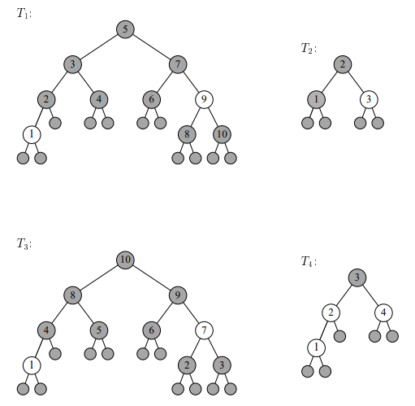

# L6 Uge 10

## A

### A1 Eksamen juni 2008, opgave 4 b

Tegn alle mulige binære søgetræer, som har højde 2
og indeholder fire knuder med nøglerne 1, 2, 3 og 4.


### A2 (Cormen et al. exercise 12.2-1 side 293, spørgsmål a–c)

Suppose that we have numbers between 1 and 1000 in a binary search tree, and we
want to search for the number 363. Which of the following sequences could not be
the sequence of nodes examined?

A) $2, 252, 401, 398, 330, 344, 397, 363$

- Possible

B) $924, 220, 911, 244, 898, 258, 362, 363$

- Possible

C) $925, 202, 911, 240, 912, 245, 363$

- Not Possible

### A3 (Cormen et al. exercise 12.2-3 side 293)

Write the TREE-PREDECESSOR procedure.

```text
TREE-PREDECESSOR(x)
    if x.left =/= NIL
        return TREE-MAXIMUM(x.left)
    y = x.p
    while y =/= NIL and x == y.left
        x = y
        y = y.p
    return y
```

### A4 (Cormen et al. exercise 13.1-2 side 311)

Draw the red-black tree that results after TREE-INSERT is called on the tree in
Figure 13.1 with key 36. If the inserted node is colored red, is the resulting tree a red-black tree? What if it is colored black?


- 36 Colored `RED`: Not a red-black tree -> Two reds in a row.
- 36 Colored `BLACK`: Not a red-black tree -> Two paths from 38 with different amount of black nodes.

### A5 (Cormen et al. exercise 13.1-6 side 312)

What is the largest possible number of internal nodes in a red-black tree with blackheight k? What is the smallest possible number?

- The root is always black, and at most there will be one red node between any two black nodes, so for the highest possible tree will be $2k +1$ high.
- To get the largest amount of nodes in the tree, we make it complete, this gives $2^{2k+1} - 1$ nodes
- To get the smallest amount of nodes in the tree, we make all nodes black, this gives $2^{k+1} - 1$ nodes

### A6 (Cormen et al. exercise 12.3-3 side 299)

We can sort a given set of n numbers by first building a binary search tree containing these numbers (using TREE-INSERT repeatedly to insert the numbers one by
one) and then printing the numbers by an inorder tree walk. What are the worstcase and best-case running times for this sorting algorithm?

- Best case: Random number -> Making the tree as balanced as possible, this makes the tree at most $O(\log n)$ high, this makes the running time $O(n \log n)$.
- Worst case: Sorted numbers -> Only goin in one direction, making the while loop last longer, this makes the tree have heigth n, and makes the running time $\Theta (n^2)$.

### A7 (Cormen et al. exercise 12.1-5 side 289)

Argue that since sorting n elements takes $\Omega(n \log n)$ time in the worst case in the comparison model, any comparison-based algorithm for constructing a binary search tree from an arbitrary list of n elements takes $\Omega(n \log n)$ time in the worst case.

- If we could build a binary-search-tree in worst case $o(n \log n)$ time, then read the element in linear $(\Theta(n))$ time, then we could sort in $o(n \log n)$ time, which would be better than any comparison-based algorithm, which is not possible.

### A8  Eksamen juni 2013, opgave 5

A)
Vi ser her på at sortere n heltal med værdier mellem $0$ og $n^4$. Angiv den asymptotiske worstcase køretid på denne type data for flg. sorteringsalgoritmer:

i) CountingSort

- $k = n^4 - 1$
- $O(n + k)$

ii) RadixSort, når heltal betragtes som bestående af 4 digits
med værdier mellem 0 og n.

- $k = n^4 - 1$
- $d = 5$
- $O(nk/d)$

iii) QuickSort

- $O(n^2)$

iv) MergeSort

- $O(n \log n)$

v) InsertionSort

- $O(n^2)$

B) Hvis CountingSort sorterer heltal med værdier mellem 0 og 7 (inkl.), hvad
er da indholdet af array C efter afslutningen af algoritmen (med pseudo-kode
som angivet i lærebogen side 195), når input A er som følger?


### A9 Eksamen jan 2005, opgave 1

Nedenfor er tegnet nogle binære træer med røde og sorte knuder. Grå cirkler symboliserer sorte knuder, og hvide cirkler symboliserer røde knuder.

A) Hvilke af følgende fire træer er rød-sorte træer? Begrund dine svar.



T1

- Is a red-black tree.
- All properties are met.

T2

- Is not a red-black tree.
- From 2 the path to a NIL, contains more black node, on the left than the right.

T3

- Is not a binary-search-tree.
- All numbers on the right side are smaller than 10

T4

- Not a red-black tree.
- There are two red nodes next to each other.

B) Betragt følgende rød-sorte træ.


Nu indsættes et element med nøgle 5. Tegn træet, som det ser ud efter indsættelsen. Vis de enkelte trin i indsættelsen.


### A10 (Cormen et al. exercise 13.3-2 side 322)

Show the red-black trees that result after successively inserting the keys $41,38,31,12,19,8$ into an initially empty red-black tree.


## B

### B1 (Cormen et al. exercise 12.1-2 side 289)

What is the difference between the binary-search-tree property and the min-heap
property (see page 153)? Can the min-heap property be used to print out the keys
of an n-node tree in sorted order in $O(n)$ time? Show how, or explain why not.

- A BST does not have the smallest element in the top, a min-heap does.
- The left child of a node in a BST is always less than its parent and the right is larger than its parent. This is not always the case for a min-heap.
- So no you can not use the min-heap property to print out at tree in sorted order in $O(n)$ time.

### B2 (Cormen et al. exercise 14.2-4 side 348)

We wish to augment red-black trees with an operation RB-ENUMERATE $(x, a, b)$
that outputs all the keys k such that $a \le k \le b$ in a red-black tree rooted at x.
Describe how to implement RB-ENUMERATE in $\Theta(m+ \log n)$ time, where m is the
number of keys that are output and n is the number of internal nodes in the tree.
(Hint: You do not need to add new attributes to the red-black tree.)

```text
RB-ENUMERAT(x,a,b)
    if a <= x.key and x.key <= b        // x is in the interval a,b
        print x                         // 
    if a <= x.key and x.left =/= NIL    // x is above the lower limit, a, and the left child exists
        RB-ENUMERAT(x.left,a,b)         // recall with the left child as the new x
    if x.key <= b and x.right =/= NIL   // x is below the upper limis, b, and the right child exists
        RB-ENUMERATE(x.right,a,b)       // recall with the right child as the new x
    return                              // x is out side the limit
```

- There could be $O(\log n)$ recursive calls, because that is the potential height of the tree
- We hava to print $m$ times, $\Theta(m)$
- So we get $\Theta(m + \log n)$

### B3 Eksamen juni 2011, opgave 1

Denne opgave handler om rød-sorte træer.

A)

Betragt de otte træer i figur 1. Knuder tegnet med fed er sorte, og resten er
røde. Angiv, hvilke af de otte træer der er rød-sorte træer.


- T1: Falsk, 2 > 1
- T2: Falsk, rød rod
- T3: Sand
- T4: Sand
- T5: Falsk, To røde i træk
- T6: Falsk, Flere sorte i stien: 2, 3, 4
- T7: Falsk, Flere sorte i stien: 2, 4, 3
- T8: Sand

B)

Betragt nedenstående rød-sorte træ T


Nu indsættes en knude med nøgle 3.

Hvilket af træerne i figur 2 og 3 svarer til T, efter at knuden med nøgle 3 er
indsat?


- The resulting tree is T7

### B4  Implementer Countingsort

[Java](./java/L6.java)
