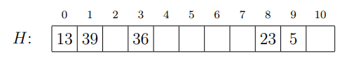
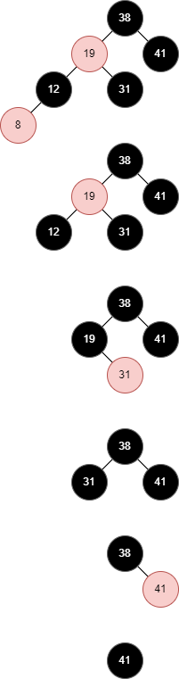

# L7 Uge 11

## A

### A.1 Eksamen juni 2015, opgave 8

A) Angiv em farveromg af knuderne i træet nedenfor som gør det til et rød-sort træ.

Svar ved at skrive en liste af navnene på de sorte knuder og en liste med navnene på de røde knuder

Sorte: $\{b,a,c,e\}$

Røde: $\{d\}$

B)

I overstående rød-sort træ indsættes 11 under brug af algorithmen fra lærebogen. Angiv hvilken af nedstående fire træer som er resultatet.

- Resultatet er T3

### A.2 Eksamen juni 2009, opgave 1, spørgsmål b

Betragt nedenstående rød-sorte træ, hvor sorte knuder
er tegnet med fed. Tegn træet, som det ser ud, efter at knuden med nøgle 2
er slettet.

### A.3 Eksamen juni 2016, opgave 4

Nedenstående er en hashtabel H som bruger hashfunktionen

$h'(x)=(7x+4) \mod 11$

samt linear probing (i lærebogen kaldes $h'(x)$ for “auxiliary hash function” i denne sammenhæng).

Indsæt værdierne 18 og 26 (i den rækkefølge) Angiv udseendet af hashtabellen efter hver af de to indsættelser.
Svar ved at skrive indholdet af H i rækkefølge fra venstre mod højre, med tomme pladser angivet som x

- 18:
  - $h(18,0) = (h'(18) + 0) \mod 11 = 9$
  - Plads 9 er ledig

$H: \{67,20,17,x,33,x,x,16,2,x,18,15\}$

- 26:
  - $h(26,0) = (h'(26) + 0)) \mod 11 = 10$
  - Plads 10 er allered optaget
  - $h(26,1) = (h'(26) + 1)) \mod 11 = 0$
  - Plads 0 er allerede optaget
  - $h(26,2) = (h'(26) + 2)) \mod 11 = 1$
  - Plads 1 er allerede optaget
  - $h(26,3) = (h'(26) + 3)) \mod 11 = 2$
  - Plads 2 er allerede optaget
  - $h(26,4) = (h'(26) + 4)) \mod 11 = 3$
  - Plads 3 er ledig

$H: \{67,20,17,26,33,x,x,16,2,x,18,15\}$

### A.4 (Cormen et al. exercise 11.2-2 side 261)

Demonstrate what happens when we insert the keys $5,28,19,15,20,33,12,17,10$ into a hash table with collisions resolved by chaining. Let the table have 9 slots, and let the hash function be $h(k) = k \mod 9$

$H: \{[],[],[],[],[],[],[],[],[]\}$

- 5:
  - $h(5) = 5 \mod 9 = 5$
  - $H: \{[],[],[],[],[],[5],[],[],[]\}$

- 28:
  - $h(28) = 28 \mod 9 = 1$
  - $H: \{[],[28],[],[],[],[5],[],[],[]\}$

- 19:
  - $h(19) = 19 \mod 9 = 1$
  - $H: \{[],[28,19],[],[],[],[5],[],[],[]\}$

- 15:
  - $h(15) = 15 \mod 9 = 6$
  - $H: \{[],[28,19],[],[],[],[5],[15],[],[]\}$

- 20:
  - $h(20) = 20 \mod 9 = 2$
  - $H: \{[],[28,19],[20],[],[],[5],[15],[],[]\}$

- 33:
  - $h(33) = 33 \mod 9 = 6$
  - $H: \{[],[28,19],[20],[],[],[5],[15,33],[],[]\}$

- 12:
  - $h(12) = 12 \mod 9 = 3$
  - $H: \{[],[28,19],[20],[12],[],[5],[15,33],[],[]\}$

- 17:
  - $h(17) = 17 \mod 9 = 8$
  - $H: \{[],[28,19],[20],[12],[],[5],[15,33],[],[17]\}$

- 10:
  - $h(10) = 10 \mod 9 = 1$
  - $H: \{[],[28,19,10],[20],[12],[],[5],[15,33],[],[17]\}$

### A.5 (Cormen et al. exercise 11.4-1 side 277)

Consider inserting the keys $10,22,31,4,15,28,17,88,59$ into a hash table of length $m = 11$ using open addressing with the auxiliary hash function $h'(k)=k$.

Illustrate the result of inserting these keys using linear probing, using quadratic
probing with $c1 = 1$ and $c2 = 3$, and using double hashing with $h_1(k) = k$ and
$h_2(k) = 1 + (k \mod (m - 1))$

$H: \{x,x,x,x,x,x,x,x,x,x,x\}$

- Linear: $h(k,i) = (h'(k) + i) \mod 11$

  - 10:
    - $h(10,0) = (10 + 0) \mod 11 = 10$
    - $H: \{x,x,x,x,x,x,x,x,x,x,10\}$
  - 22:
    - $h(22,0) = (22 + 0) \mod 11 = 0$
    - $H: \{22,x,x,x,x,x,x,x,x,x,10\}$
  - 31:
    - $h(31,0) = (31 + 0) \mod 11 = 9$
    - $H: \{22,x,x,x,x,x,x,x,x,31,10\}$
  - 4:
    - $h(4,0) = (4 + 0) \mod 11 = 4$
    - $H: \{22,x,x,x,4,x,x,x,x,31,10\}$
  - 15:
    - $h(15,0) = (15 + 0) \mod 11 = 4$
    - Plads 4 er allerede optaget
    - $h(15,1) = (15 + 1) \mod 11 = 5$
    - $H: \{22,x,x,x,4,15,x,x,x,31,10\}$

- Quadratic: $h(k,i) = (h'(k) + 1 \cdot i + 3 \cdot i^2) \mod 11$

  - 10:
    - $h(10,0) = (10 + 1 \cdot 0 + 3 \cdot 0^2) \mod 11 = 10$
    - $H: \{x,x,x,x,x,x,x,x,x,x,10\}$
  - 22:
    - $h(22,0) = (22 + 1 \cdot 0 + 3 \cdot 0^2) \mod 11 = 0$
    - $H: \{22,x,x,x,x,x,x,x,x,x,10\}$
  - 31:
    - $h(31,0) = (31 + 1 \cdot 0 + 3 \cdot 0^2) \mod 11 = 9$
    - $H: \{22,x,x,x,x,x,x,x,x,31,10\}$
  - 4:
    - $h(4,0) = (4 + 1 \cdot 0 + 3 \cdot 0^2) \mod 11 = 4$
    - $H: \{22,x,x,x,4,x,x,x,x,31,10\}$
  - 15:
    - $h(15,0) = (15 + 1 \cdot 0 + 3 \cdot 0^2) \mod 11 = 4$
    - Plads 4 er allerede optaget
    - $h(15,1) = (15 + 1 \cdot 1 + 3 \cdot 1^2) \mod 11 = 8$
    - $H: \{22,x,x,x,4,x,x,x,15,31,10\}$

- Doubl: $h(k,i) = (h'(k) + i \cdot h''(k)) \mod 11$

  - 10:
    - $h(10,0) = (10 + 0 \cdot (1 + (10 \mod (10)))) \mod 11 = 10$
    - $H: \{x,x,x,x,x,x,x,x,x,x,10\}$
  - 22:
    - $h(22,0) = (22 + 0 \cdot (1 + (22 \mod (10)))) \mod 11 = 0$
    - $H: \{22,x,x,x,x,x,x,x,x,x,10\}$
  - 31:
    - $h(31,0) = (31 + 0 \cdot (1 + (31 \mod (10)))) \mod 11 = 9$
    - $H: \{22,x,x,x,x,x,x,x,x,31,10\}$
  - 4:
    - $h(4,0) = (4 + 0 \cdot (1 + (4 \mod (10)))) \mod 11 = 4$
    - $H: \{22,x,x,x,4,x,x,x,x,31,10\}$
  - 15:
    - $h(15,0) = (15 + 0 \cdot (1 + (15 \mod (10)))) \mod 11 = 4$
    - Plads 4 er allerede optaget
    - $h(15,1) = (15 + 1 \cdot (1 + (15 \mod (10)))) \mod 11 = 10$
    - Plads 10 er allerede optaget
    - $h(15,1) = (15 + 1 \cdot (1 + (15 \mod (10)))) \mod 11 = 5$
    - $H: \{22,x,x,x,4,15,x,x,x,31,10\}$

### A.6 Eksamen januar 2008, opgave 1c

Dette spørgsmål handler om hashing med lineær probing. Betragt følgende hashtabel med 10 pladser

og følgende hashfunktion

$$h(k)=k \mod 10$$

Som det ses, er der allerede indsat fem elementer i hashtabellen.
Nu indsættes et element med nøgle 4. På hvilken plads havner dette element?

- $h(4)= 4 \mod 10 = 4$
- Plads 4 er allerede optaget
- Næste ledige plads er 6

- Det nye element indsættes på plads 6

### A.7 Eksamen januar 2006, opgave 1a

Dette spørgsmål handler om hashing med åben adressering. Betragt følgende hashtabel med 11 pladser

og følgende hash-funktion

$$h(k,i)=(h_1(k) + i h_2(k)) \mod 11$$

hvor

$$h_1(k) = k \mod 11$$

$$h_2(k) = 1 + (k \mod 10)$$

Som det ses ovenfor, er der allerede indsat tre elementer i hashtabellen.
Nu indsættes et element med nøgle 18. På hvilken plads havner dette element

- $h(18,0) = (h_1(18) + 0 h_2(18)) \mod 11$
- $= 7 \mod 11 = 7$
- Plads 7 er allerede optaget.

- $h(18,1) = (h_1(18) + 1 h_2(18)) \mod 11$
- $= (7 + 9) \mod 11 = 16 \mod 11 = 5$
- Plads 5 er ledig

- Det nye element indsættes på plads 5

### A.8 Eksamen juni 2015, opgave 4

Nedenstående er en hashtabel H der bruger quadratic probing, med auxiliary
hashfunktion $h'(x) = (3x + 5) \mod 11$ og med konstanter $c1 = 3$ og $c2 = 1$.

Indsæt værdierne 22, 16 og 17 (i den rækkefølge). Angiv udseendet af hashtabellen efter hver af de tre indsættelser.

Svar for hver indsættelse ved at skrive indholdet af H i rækkefølge fra venstre
mod højre, med tomme pladser angivet som x.

Hashfunktion

$$h(k,i) = (h'(k) + 3 \cdot i + 1 \cdot i^2) \mod 11$$

- 22:
  - $h(22,0) = (h'(22) + 3 \cdot 0 + 0^2) \mod 11 = 5$
  - Plads 5 er ledig

$H: \{13,39,x,36,x,22,x,x,23,5,x\}$

- 16:
  - $h(16,0) = (h'(16) + 3 \cdot 0 + 0^2) \mod 11 = 9$
  - Plads 9 er allerede optaget
  - $h(16,1) = (h'(16) + 3 \cdot 1 + 1^2) \mod 11 = 2$
  - Plads 2 er ledig

$H: \{13,39,16,36,x,22,x,x,23,5,x\}$

- 17:
  - $h(17,0) = (h'(17) + 3 \cdot 0 + 0^2) \mod 11 = 1$
  - Plads 1 er allerede optaget
  - $h(17,1) = (h'(17) + 3 \cdot 1 + 1^2) \mod 11 = 5$
  - Plads 5 er allerede optaget
  - $h(17,2) = (h'(17) + 3 \cdot 2 + 2^2) \mod 11 = 0$
  - Plads 0 er allerede optaget
  - $h(17,3) = (h'(17) + 3 \cdot 3 + 3^2) \mod 11 = 8$
  - Plads 8 er allerede optaget
  - $h(17,4) = (h'(17) + 3 \cdot 4 + 4^2) \mod 11 = 7$
  - Plads 7 er ledig

$H: \{13,39,16,36,x,22,x,17,23,5,x\}$

## B

### B.1 (Cormen et al. exercise 13.4-3 side 330)

In Exercise 13.3-2, you found the red-black tree that results from successively inserting the keys $41,38,31,12,19,8$ into an initially empty tree. Now show the red-black trees that result from the successive deletion of the keys in the order $8,12,19,31,38,41$.

### B.2 Eksamen juni 2013, opgave 3 b

Nedenstående er en hashtabel H som bruger hashfunktionen

$$h'(x)=(3x+2)\mod 11$$

samt linear probing (i lærebogen kaldes $h′(x)$ for “auxiliary hash function” i denne sammenhæng).

Indsæt først 60 og dernæst 45, og angiv udseendet af hashtabellen efter den sidste af de to indsættelser.

Svar ved at skrive indholdet af H i rækkefølge fra venstre mod højre, med tomme pladser angivet som x.

$$h(k,i) = (h'(k) + i) \mod 11$$

$H: \{3,x,x,59,x,23,38,53,x,72,87\}$

- 60:
  - $h(60,0) = (((3 \cdot 60 + 2) \mod 11) + 0) \mod 11 = 6$
  - Plads 6 er allerede optaget
  - $h(60,1) = (((3 \cdot 60 + 2) \mod 11) + 1) \mod 11 = 7$
  - Plads 7 er allerede optaget
  - $h(60,2) = (((3 \cdot 60 + 2) \mod 11) + 2) \mod 11 = 8$

$H: \{3,x,x,59,x,23,38,53,60,72,87\}$

- 45:
  - $h(45,0) = (((3 \cdot 45 + 2) \mod 11) + 0) \mod 11 = 5$
  - Plads 5 er allerede optaget
  - $h(45,1) = (((3 \cdot 45 + 2) \mod 11) + 1) \mod 11 = 5$
  - Plads 6 er allerede optaget
  - $h(45,2) = (((3 \cdot 45 + 2) \mod 11) + 2) \mod 11 = 5$
  - Plads 7 er allerede optaget
  - $h(45,3) = (((3 \cdot 45 + 2) \mod 11) + 3) \mod 11 = 5$
  - Plads 8 er allerede optaget
  - $h(45,4) = (((3 \cdot 45 + 2) \mod 11) + 4) \mod 11 = 5$
  - Plads 9 er allerede optaget
  - $h(45,5) = (((3 \cdot 45 + 2) \mod 11) + 5) \mod 11 = 5$
  - Plads 10 er allerede optaget
  - $h(45,6) = (((3 \cdot 45 + 2) \mod 11) + 6) \mod 11 = 5$
  - Plads 0 er allerede optaget
  - $h(45,7) = (((3 \cdot 45 + 2) \mod 11) + 7) \mod 11 = 5$

$H: \{3,45,x,59,x,23,38,53,60,72,87\}$

### B.3 Eksamen juni 2009, opgave 1 c

Betragt følgende hash-tabel med 16 pladser.

Der bruges åben adressering og kvadratisk probing med

$$h'(k) = k \mod 16$$

og

$$c_1 = c_2 = 1/2$$

Nu insættes et element med nøglen 71. På hvilken plads havner elementet?

$$h(k,i) = (h'(k) + \frac{1}{2} \cdot i + \frac{1}{2} \cdot i^2) \mod 16$$

- $$h(71,0) = ((71 \mod 16) + \frac{1}{2} \cdot 0 + \frac{1}{2} \cdot 0^2) \mod 16 = 7$$
- Plads 7 er allerede optaget
- $$h(71,1) = ((71 \mod 16) + \frac{1}{2} \cdot 1 + \frac{1}{2} \cdot 1^2) \mod 16 = 8$$
- Plads 8 er allerede optaget
- $$h(71,2) = ((71 \mod 16) + \frac{1}{2} \cdot 2 + \frac{1}{2} \cdot 2^2) \mod 16 = 10$$
- Plads 10 er allerede optaget
- $$h(71,3) = ((71 \mod 16) + \frac{1}{2} \cdot 3 + \frac{1}{2} \cdot 3^2) \mod 16 = 2$$

- Det nye element insættes på plads 2
