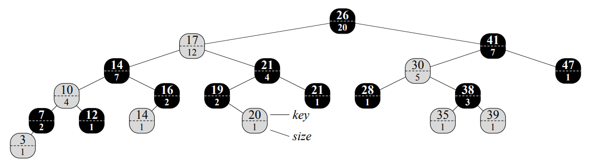
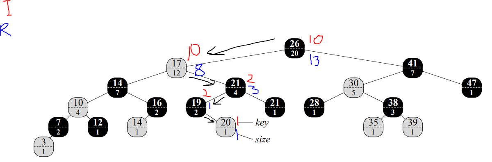
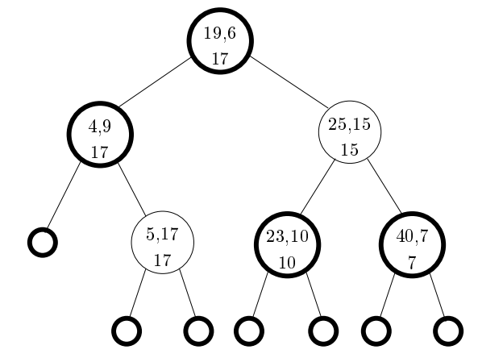
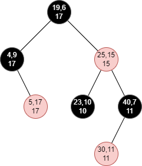
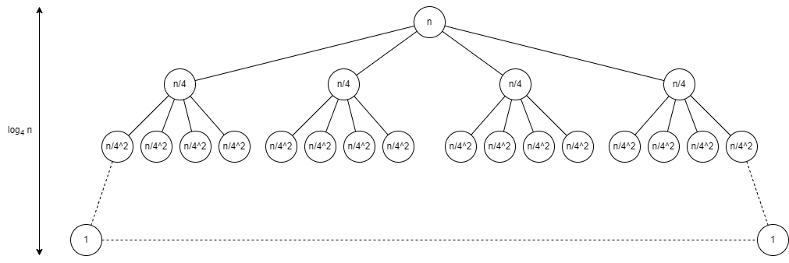
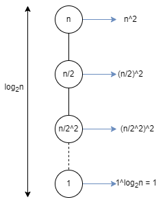

# L8 Uge 12

## A

### A1 (Cormen et al. exercise 14.1-1 side 344)

Show how OS-SELECT$(T.root, 10)$ operates on the red-black tree T of Figure 14.1.



```text
OS-SELECT(x,i)
  r = x.left.size + 1
  if i == r
    return x
  else if i < r
    return OS-SELECT(x.left,i)
  else
    return OS-SELECT(x.right,i - r)
```

1. T.root, 10
2. T.root.left, 10
3. T.root.left.right, 2
4. T.root.left.right.left, 2
5. T.root.left.right.left.right, 1
6. return 20



### A2 (Cormen et al. exercise 14.1-2 side 344)

Show how OS-RANK$(T,x)$ operates on the red-black tree T of Figure 14.1 and the node $x$ with $x.key = 35$.

```text
OS-RANK(T,x)
  r = x.left.size + 1
  y = x
  while y =/= T.root
    if y == y.p.right
      r = r + y.p.left.size + 1
    y = y.p
  return r
```

1. r = 1, y = 35
2. r = 1, y = 38
3. r = 3, y = 30
4. r = 3, y = 41
5. r = 16, y = 20
6. return 16

### A3 (Cormen et al. exercise 14.1-5 side 344)

Given an element $x$ in an n-node order-statistic tree and a natural number $i$, how can we determine the $i$th successor of $x$ in the linear order of the tree in $O(\log n)$ time?

- We want to find an element so we use: OS-SELECT
- And since it has to be the $i$th successor to $x$, we use: OS-RANK$(T,x) + i$
- If we combine them, we get: OS-SELECT$(T,$OS-RANK$(T,x) + i)$
- This has a running time of $O(h)$, where $h$ is the height of the tree
- For at red-black tree $h$ happens to be $\log n$
- So the final runnig time is $O(\log n)$

### A4 Eksamen januar 2008, opgave 3

Lad $(x1, y1),(x2, y2), . . .,(xn, yn)$ være punkter i planen. Antag, at koordinaterne er positive heltal, og at alle x-koordinaterne er forskellige.
Vi skal se på operationen `MinAbove(t)`. Hvis der findes mindst ét punkt, hvis y-koordinat er større end eller lig med t, returneres det af disse punkter, som har mindst x-værdi. Ellers meddeles, at et sådant punkt ikke findes. I nedenstående eksempel er det punktet med cirkel omkring, som returneres.

A) Hvad er `MinAbove(10)` for punkterne

$$(4,9),(5,17),(19,6),(23,10),(25,15),(40,7)$$

- Det første punkt, som er større end eller lig med 10, er (5,17)

I det følgende betragtes en udvidelse af rød-sorte træer til opbevaring af punkterne. Hver knude indeholder et punkt, dvs. x-koordinat og y-koordinat, og x-koordinaterne anvendes som nøgler i træet. Desuden indeholder hver knude et tal $y_{max}$, som angiver den største y-koordinat i knudens undertræ.
Nedenfor er vist et udvidet rød-sort træ for punkterne i spørgsmål a. I knuderne er angivet x, y øverst og $y_{max}$ nederst. Sorte knuder er tegnet med fed
streg.



B) Beskriv, hvordan et udvidet rød-sort træ kan vedligeholdes under indsættelse og sletning af punkter.

- Insættelse:
  - Påvirker kun de knude i stien fra den nye til roden.
  - Opdater fra den nye knude op til roden.
- Sletning
  - Påvirker kun de knuder i stien fra den slettede til rode.
  - Opdater fra bunden af hvor den slettede knude var til rode.
- Ved rotationer skal alle påvirkede knuders værdi genberegnes.

C) Illustrer en del af svaret fra spørgsmål b ved at indsætte punktet (30,11) i det udvidede rød-sorte træ, som er vist øverst på denne side

1. 30 > 19, so we go right
2. 30 > 25, so we go right
3. 30 < 40, so we go left
4. we hit at null, so we add the node
5. all red-black tree rules are met
6. the biggest y-value in the subtree under the (30,11) node is 11
7. the biggest y-value in the subtree under the (40,7) node is 11, so we update it
8. the biggest y-value in the subtree under the (25,15) node is 15, so we can stop here



D) Beskriv, hvordan `MinAbove(t)` kan udføres i tid $O(\log n)$

- If we just look at the extra information in the node
- This gives only one path, which is at most $\log n$ long
- So walking along the red-black tree to find t will give us $O(\log n)$ running time

### A5 (Cormen et al. exercise 2.1-3 side 22)

Consider the searching problem:
Input: $A$ sequence of $n$ numbers $A = \{a_1,a_2,...,a_n\}$ and a value $v$.
Output: An index $i$ such that $v = A[i]$ or the special value NIL if $v$ does not appear in $A$.
Write pseudocode for linear search, which scans through the sequence, looking for $v$. Using a loop invariant, prove that your algorithm is correct. Make sure that your loop invariant fulfills the three necessary properties.

```text
LINEAR-SEARCH(A,x)
  for i = 1 to A.length
    if A[i] == x
      return i
  return NIL
```

- Loop invariant:
  - For each iteration in the for-loop, are all elements from 1 to $i-1$ not x
- Initialization:
  - At the start i = 1, so there is no elements to the left of the current index.
- Maintenance:
  - i holds its value for the duration of an iteration, and is only incremented at the start of a new iteration.
- Termination:
  - Since the loop will break after at most A.length runs. If this happens we get NIL, and thus know that the element is not present in the array.

### A6

Løs rekursionsligningen

$$T(n) = 4 \cdot T(n/3) + n$$

Løs den både via rekursionstræmetoden og via Master Theorem

- Rekursionstræmetoden:
  - $a = 4$
  - $b = 3$
  - $f(n) = n$

  - 

  - $n/4^{height} = 1 \Leftrightarrow$
  - $4^{height} = n \Leftrightarrow$
  - $height = \log_4 n$

  - Arbejde pr. lag:
  $$4^i \cdot \frac{n}{2^i}$$
  - Arbejde i sidste lag:
  $$4^{\log_4 n} \cdot 1 = n$$
  - $T(n) = \Theta(n)$

- Master Theorem:
  - $a = 4$
  - $b = 3$
  - $f(n) = n$
  - $\alpha = \log_3 4 \approx 0.79$
  - $f(n) = n = \Omega(n^{0.79... + \epsilon}) = \Omega(n^{\alpha + \epsilon})$

Vi får case 3, så der gælder $T(n) = \Theta(f(n)) = \Theta(n)$

### A7 (Cormen et al. exercise 4.4-2 side 92)

Use a recursion tree to determine a good asymptotic upper bound on the recurrence $T(n) = T(n/2) + n^2$. Use the substitution method to verify your answer.

- Recusiontree
  - $a = 1$
  - $b = 2$
  - $f(n) = n^2$
  - 
  - $n / 1^{height} = 1 \Leftrightarrow$
  - $1^{height} = n \Leftrightarrow$
  - $height = \log_1 n = 1$
  - Arbejde pr. lag:
  $$1^i \cdot (\frac{n}{2^i})^2 = n^2 \cdot (\frac{1}{4})^i$$
  - Sum af arbjede:
  $$T(n) = \sum_{i=0}^{\log n - 1}n^2 \cdot (\frac{1}{4})^i + \Theta(1)$$
  $$< \sum_{i=0}^{\infin}n^2 \cdot (\frac{1}{4})^i + \Theta(1)$$
  $$= \frac{1}{1 - (1 / 4)\cdot n^2} + \Theta(1)$$
  $$= \Theta(n^2)$$

- Master Theorem:
  - $a = 1$
  - $b = 2$
  - $f(n) = n^2$
  - $\alpha = \log_2 1 = 0$
  - $f(n) = n^2 = \Omega(n^{0 + \epsilon}) = \Omega(n^{\alpha + \epsilon})$

Vi får case 3, så gælder $T(n) = \Theta(f(n)) = \Theta(n^2)$

### A8 Eksamen juni 2010, opgave 1a

Løs følgende rekursionsligning

$$T(n) = 16 \cdot T(n/2) + n^4 + n^2$$

- $a = 16$
- $b = 2$
- $f(n) = n^4 + n^2$
- $n^4$ is dominant
- $\alpha = \log_2 16 = \frac{\ln(16)}{\ln(2)} \approx 4$
- $f(n) = n^4 + n^2 = \Omega(n^{4 + \epsilon}) = \Omega(n^{\alpha + \epsilon})$
Vi får case 3, så gælder $T(n) = \Theta(f(n)) = \Theta(n^4)$

## B

### B1 (Cormen et al. exercise 14.1-7 side 345)

Show how to use an order-statistic tree to count the number of inversions (see Problem 2-4) in an array of size $n$ in time $O(\log n)$.

- We can use the rank of the node to find its invertion
- To do this we use OS-RANK, which takes $O(\log n)$ time
- And we do this for all nodes, $n$
- In total we get $O(n \log n)$

### B2 Eksamen juni 2013, opgave 6

Følgende kode har til formål at beregne $n! = 1 \cdot 2 \cdot 3 \cdot ... \cdot (n-1) \cdot n$ for heltal $n \ge 1$

```text
FACTORIAL(n)
  i = n
  r = 1
  while i > 1
    r = r * i
    i = i - 1
  return r
```

Angiv for hvert af nedstående udsagn om det er en løkke-invariant for algotimen (dvs. altid er sandt når testen i starten af while-løkken udføres) for input der er heltal $n \ge 1$. (Du behøver ikke argumentere for svarene).

- udsagn
  1. $i \ge 1$
  2. $r = i!$ $\checkmark$
  3. $r! \cdot i! = n1$
  4. $r = n! / i!$
  5. $r = n!$

### B3 Eksamen januar 2006, opgave 1c

Angiv den asymptotiske løsning til rekursionsligningen

$$T(n) = 3T(n/3) + n^2$$

- $a = 3$
- $b = 3$
- $f(n) = n^2$
- $\alpha = \log_3 3 = 1$
- $f(n) = n^2 = \Omega(n^{\alpha + \epsilon}) = \Omega(n^{1 + \epsilon})$
Vi har case 1, så gælder $T(n) = \Theta(n^{\alpha}) = \Theta(n)$

### B4 (Cormen et al. exercise 4.4-7 side 93)

Draw the recursion tree for $T(n) = 4T(\lfloor n/2 \rfloor) + cn$, where $c$ is a constant, and provide a tight asymptotic bound on its solution. Verify your bound by the substitution method.

- $a = 4$
- $b = 2$
- $f(n) = cn$
- $h = \log_4 n$
- $leaves = 4^{\log n} = n^{\log 4} = n^2$
- Arbejde pr. lag:
$$4^i \cdot (\frac{cn}{2^i}) = cn \cdot (\frac{4}{2})^i = 2^i \cdot cn$$
- Samlet arbejde:
$$\sum_{i=0}^{\log n - 1}2^i \cdot cn + \Theta(n^2)$$
$$= cn(\frac{2^{\log n}- 1 }{2 - 1}) + \Theta(n^2)$$
$$= \Theta(n^2)$$

- $\alpha = \log_2 4 = \frac{\ln 4}{\ln 2} = 2$
- $f(n) = cn = O(n^{2 + \epsilon}) = O(n^{\alpha + \epsilon})$
Så vi får case 1, så gælder $T(n) = \Theta(n^{\alpha}) = \Theta(n^2)$
