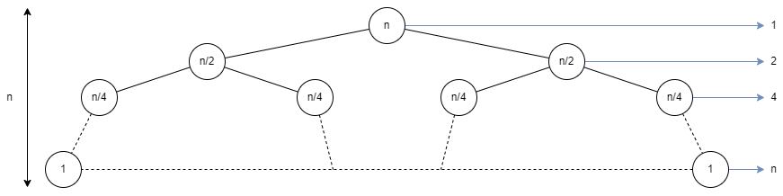

# L9 uge 13

## A

### A1 (Cormen et al. exercise 4.5-1 side 96)

Use the master method to give tight asymtotic bounds for the following recurences.

A) $T(n) = 2T(n/4) + 1$

$a = 2$

$b = 4$

$f(n) = 1$

$\alpha = \log_4 2 = 1/2$

$1 \le \sqrt{n}$

$f(n) = O(n^{1/2 + \epsilon})$

Rule 1. $\Theta(n^{1/2}) = \Theta(\sqrt{n})$

B) $T(n) = 2T(n/4) + \sqrt{n}$

$a = 2$

$b = 4$

$f(n) = \sqrt{n}$

$\alpha = \log_4 2 = 1/2$

$\sqrt{n} = \sqrt{n}$

$f(n) = \Theta(n^{1/2}) = \Theta(\sqrt{n})$

Rule 2. $\Theta(n^{1/2} \log n) = \Theta(\sqrt{n} \log n)$

C) $T(n) = 2T(n/4) + n$

$a = 2$

$b = 4$

$f(n) = n$

$\alpha = \log_4 2 = 1/2$

$n \ge \sqrt{n}$

$f(n) = \Omega(n^{1/2 + \epsilon})$

If $1 > c > 0.5$

$2f(n/4) \le cf(n) \Rightarrow$

$2 (n/4) \le c n \Rightarrow$

$n/2 \le cn$

Rule 3. $\Theta(f(n)) = \Theta(n)$

D) $T(n) = 2T(n/4) + n^2$

$a = 2$

$b = 4$

$f(n) = n^2$

$n^2 \ge \sqrt{n}$

$\alpha = \log_4 2 = 1/2$

$f(n) = \Omega(n^{1/2 + \epsilon})$

If $1 > c > 0.5$

$2f(n/4) \le cf(n) \Rightarrow$

$2 (\sqrt{n}/4) \le c \sqrt{n} \Rightarrow$

$\sqrt{n}/2 \le c \sqrt{n}$

Rule 3. $\Theta(f(n)) = \Theta(\sqrt{n})$

### A2 (Cormen et al. exercise 4.5-3 side 97)

Use the master theorom to show that the solution to the binary-search recurrence $T(n) = T(n/2) + \Theta(1)$ is $T(n) = \Theta(\log n)$

$a = 1$

$b = 2$

$f(n) = \Theta(1)$

$\alpha = \log_2 1 = 0$

$1 = n^0$

$f(n) = \Theta(n^{0 + \epsilon})$

Rule 2. $\Theta(n^0 \log n) = \Theta(\log n)$

### A3 (Cormen et al. exercise 4.4-4 side 93)

Use a recusion tree to determine a good asymtotic upper bound on the recurrence $T(n) = 2T(n-1) + 1$. Use the substitution method to verify your answer.

$a = 2$

$b = 1?$

$f(n) = 1$

$h = n$

Work for each node is $1$ so in work for each layer is $n$

$O(n^2)$

### A4 (Cormen et al. exercise 2.3-4 side 39)

We can express insertion sort as a recursive procedure as follows. In order to sort $A[1..n]$, as recusively sort $A[1..n-1]$ and insert $A[n]$ into the sorted array $A[1..n-1]$. Write a recurrence for the worst-case running time fo this recursive version of insertion sort.

$$T(n) = \begin{cases}
\Theta(1) & \text{if $n \le c$} \\
T(n-1) + \Theta(n) & else
\end{cases}$$

### A5 (Cormen et al. exercise 4.2-1 side 82)

Use Strassen's algorithm to compute the matrix product

$$\begin{pmatrix}
1 & 3 \\
7 & 5
\end{pmatrix}
\begin{pmatrix}
6 & 8 \\
4 & 2
\end{pmatrix}$$

Show your work

$S_1 = B_{12} - B_{22} = 8 - 2 = 6$

$S_2 = A_{11} + A_{12} = 1 + 3 = 4$

$S_3 = A_{21} + A_{22} = 7 + 5 = 12$

$S_4 = B_{21} - B_{11} = 4 - 6 = -2$

$S_5 = A_{11} + A_{22} = 1 + 5 = 6$

$S_6 = B_{11} + B_{22} = 6 + 2 = 8$

$S_7 = A_{12} - A_{22} = 3 - 5 = -2$

$S_8 = B_{21} + B_{22} = 4 + 2 = 6$

$S_9 = A_{11} - A_{21} = 1 - 7 = -6$

$S_{10} = B_{11} + B_{12} = 6 + 8 = 14$

$P_1 = A_{11} \cdot S_1 = 1 \cdot 6 = 6$

$P_2 = S_2 \cdot B_{22} = 4 \cdot 2 = 8$

$P_3 = S_3 \cdot B_{11} = 12 \cdot 6 = 72$

$P_4 = A_{22} \cdot S_4 = 5 \cdot (-2) = -10$

$P_5 = S_5 \cdot S_6 = 6 \cdot 8 = 48$

$P_6 = S_7 \cdot S_8 = -2 \cdot 6 = -12$

$P_7 = S_9 \cdot S_{10} = -6 \cdot 14 = -84$

$C_{11} = P_5 + P_4 - P_2 + P_6 = A_{11} \cdot B_{11} + A_{12} \cdot B_{21}$

$C_{11} = 48 + (-10) - 8 + (-12) = 1 \cdot 6 + 3 \cdot 4 = 18$

$C_{12} = P_1 + P_2 = A_{11} \cdot B_{12} + A_{12} \cdot B_{22}$

$C_{12} = 6 + 8 = 1 \cdot 8 + 3 \cdot 2 = 14$

$C_{21} = P_3 + P_4 = A_{21} \cdot B_{11} + A_{22} \cdot B_{21}$

$C_{21} = 72 + (-10) = 7 \cdot 6 + 5 \cdot 4 = 62$

$C_{22} = P_5 + P_1 - P_3 - P_7 = A_{21} \cdot B_{12} + A_{22} \cdot B_{22}$

$C_{22} = 48 + 6 - 72 - (-84) = 7 \cdot 8 + 5 \cdot 2 = 66$

### A6 (Cormen et al. exercise 4.2-3 side 82)

How would you modify Strassen's algorithm to multiply $n \times n$ matrices in which $n$ is not an exact power of 2? Show taht the resulting algorithm runs in time $\Theta(n^{\log 7})$

- Add zeros as padding to make the matrices a multiple of 2
- The resulting matrices will at most be the double of the original

We can call the new for $m$, from this we get

$$m^{\log 7} \le (2n)^{\log 7} = 7n^{\log 7} = O(n^{log 7})$$

and

$$m^{\log 7} \ge n^{\log 7} = \Omega(n^{\log 7})$$

This results in

$$\Theta(n^{log 7})$$

## B

### B1 Eksamen juni 2013, opgave 1

Angiv løsningen til hver af følgende rekursionsligninger.

A) $T(n) = 8T(n/3) + n^2$

$a = 8$

$b = 3$

$f(n) = n^2$

$\alpha = \log_3 8 \approx 1.89$

$f(n) = \Omega(n^{1.89 + \epsilon})$

$8f(n/3) \le cf(n) \Rightarrow$

$8(n/3)^2 \le cn^2 \Rightarrow$

$n^2 8/9 \le cn^2 \Rightarrow$

$8/9 \approx 0.89 \le c < 1$

Case 3. $\Theta(f(n)) = \Theta(n^2)$

B) $T(n) = 9T(n/3) + n^2$

$a = 9$

$b = 3$

$f(n) = n^2$

$\alpha = \log_3 9 = 2$

$f(n) = \Theta(n^2)$

Case 2. $\Theta(n^{\alpha} \log n) = \Theta(n^2 \log n)$

C) $T(n) = 10T(n/3) + n^2$

$a = 10$

$b = 3$

$f(n) = n^2$

$\alpha = \log_3 10 \approx 2.10$

$f(n) = O(n^{2.10 - \epsilon})$

Case 1. $\Theta(n^{\alpha}) = \Theta(n^{\log_3 10})$

### B2 (Cormen et al. exercise 4.5-4 side 97)

Can the master method be applied to the recurrence $T(n) = 4T(n/2) + n^2 \log n$?
Why or why not? Give an asymtotic upper bound for this recurrence.

$a = 4$

$b = 2$

$f(n) = n^2 \log n$

$\alpha = \log_2 4 = 2$

$f(n) = \Omega(n^{2 + \epsilon})$

$\epsilon = 0.0001$

$$\frac{n^2 \log n}{n^{2.0001}} = \frac{\log n}{n^{0.0001}} \rightarrow 0 \ \text{for}\ n \rightarrow \infin$$

Giver

$f(n) = o(n^{\alpha + \epsilon})$

Kan ikke bruge master method

Rekursionstræmetoden

$h = \log_2 n$

Arbejde pr lag:

$4^i n/2^i \log n/2^i = 2n \log n/2^i$

Total:

$\Theta(2n \log n)$

### B3 (Cormen et al. exercise 4.4-3 side 93)

Use a recursion tree to determine a good asymptoticupper bound on the recurrence $T(n) = 4T(n/2 + 2) + n$

$a = 4$

$b = 2$

$f(n) = n$

$h = \log_2 n$

Arbejde pr lag:

$4^i n/2^i = 2n$

Total:

$\Theta(2n \log_2 n) $

### B4 (Cormen et al. exercise 4.2-5 side 82)

V. Pan has discovered a way of multiplying $68 \times 68$ matrices using 132,464 multiplications, a way of multiplying $70 \times 70$ matrices using 143,640 multiplications, and a way of multiplying $72 \times 72$ matrices using 155,424 multiplications. Which method yields the best asymptotic running time when used in a divide-and-conquer matrix-multiplication algorithm? How does it compare to Strassen’s algorithm?

First is best

### B5 (Cormen et al. exercise 4.5-2 side 97)

Professor Caesar wishes to develop a matrix-multiplication algorithm that is asymptotically faster than Strassen’s algorithm. His algorithm will use the divideand-conquer method, dividing each matrix into pieces of size $n/4 \times n/4$, and the divide and combine steps together will take $\Theta(n^2)$ time. He needs to determine how many subproblems his algorithm has to create in order to beat Strassen’s algorithm. If his algorithm creates a subproblems, then the recurrence for the running time $T(n)$ becomes $T(n) = aT(n/4) + \Theta(n^2)$. What is the largest integer value of $a$ for which Professor Caesar’s algorithm would be asymptotically faster than Strassen’s algorithm?

Strassen has running time $\Theta(n^{\log 7})$

$\log_4 a < \log 7$

$a \le 48$
