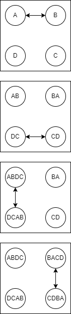
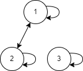

# L6 Uge 10

## 1

### 5.1 Opg 70

Suppose there are $n$ people in a group, each aware of a scandal
no one else in the group knows about. These people communicate by telephone; when two people in the group talk, they
share information about all scandals each knows about. For
example, on the first call, two people share information, so
by the end of the call, each of these people knows about two
scandals. The gossip problem asks for $G(n)$, the minimum
number of telephone calls that are needed for all $n$ people to
learn about all the scandals. Exercises 69–71 deal with the
gossip problem.

Use mathematical induction to prove that $G(n) ≤ 2n − 4 for \space n ≥ 4$.

[Hint: In the inductive step, have a new person
call a particular person at the start and at the end.]

Basis:

$G(4) \le 2 \cdot 4 - 4 = 4$

Inductive step:

$G(n+1) \le 2(n+1)-4 = 2n - 4 + 2 = 2n - 2$

If we divide the people in two: first only has the $n+1$'st person, second has the other $n$ people.
Since we know that a group of $n$ people can learn all the gossip in $\le 2n -4$ calls, we know at the second group will do so. To include the person in the first group, lets call him A, we can have one person from the second group, lets call her B. B calls A at the start, so A's gossip gets in to the group, then at the end we have B call A again, so now A learns all the others gossip. That mean we used 2 extra call, so we have used $ \le 2n - 4 + 2 = 2n - 2$

## 2

### DM547 Examen januar 2021 Opgave 5

Denne opgave handler om at bevise, at $2^n + 3^n < 4^n, for \space n\ge 2$.Hvilke af nedenstående muligheder udgør gyldige induktionsbeviser?

Svar 5.a

Basis: $2^2 + 3^2 = 4 + 9 < 16 = 4^2$

Induktionsskridt: For $n \ge 2$ gælder:

$$2^n + 3^n < 4^n \Rightarrow$$
$$4 \cdot (2^n + 3^n) < 4 \cdot 4^n \Rightarrow$$
$$2^{n+1} + 3^{n+1} < 4^{n+1}$$

Svar 5.b

Basis: $2^3 + 3^3 = 8 + 27 < 64 = 4^3$

Induktionsskridt: For $n \ge 3$ gælder:

$$2^n + 3^n < 4^n \Rightarrow$$
$$4 \cdot (2^n + 3^n) < 4 \cdot 4^n \Rightarrow$$
$$2^{n+1} + 3^{n+1} < 4^{n+1}$$

Svar 5.c

Basis: $2^2 + 3^2 = 4 + 9 < 16 = 4^2$

Induktionsskridt: For $n \ge 3$ gælder:

$$2^{n-1} + 3^{n-1} < 4^{n-1} \Rightarrow$$
$$4 \cdot (2^{n-1} + 3^{n-1}) < 4 \cdot 4^{n-1} \Rightarrow$$
$$2^n + 3^n < 4^n$$

Svar 5.d

Basis: $2^2 + 3^2 = 4 + 9 < 16 = 4^2$

Induktionsskridt: For $n \ge 2$ gælder:

$$2^n +3^n < 4^n \Rightarrow$$
$$2 \cdot 2^{n-1} + 3 \cdot 3^{n-1} < 4 \cdot 4^{n-1} \Rightarrow$$
$$2 \cdot (2^{n-1} + 3^{n-1}) < 4 \cdot 4^{n-1} \Rightarrow$$
$$2^{n-1} + 3^{n-1} < 4^{n-1}$$

Svar 5.e

Basis: $2^2 + 3^2 = 4 + 9 < 16 = 4^2$

Induktionsskridt: For $n \ge 2$ gælder:

$$2^{n+1} + 3^{n+1} < 4^{n+1} \Rightarrow$$
$$2 \cdot 2^n + 3 \cdot 3^n < 4 \cdot 4^n \Rightarrow$$
$$2^n +3^n < 4^n$$

Svar 5.f

Basis: $2^2 + 3^2 = 4 + 9 < 16 = 4^2$

Induktionsskridt: For $n \ge 2$ gælder:

$$2^{n+1} + 3^{n+1} = 2 \cdot 2^n + 3 \cdot 3^n$$
$$< 3 \cdot (2^n + 3^n)$$
$$< 3 \cdot 4^n$$
$$< 4^{n+1}$$

Svar 5.g

Basis: $2^2 + 3^2 = 4 + 9 < 16 = 4^2$

Induktionsskridt: For $n \ge 2$ gælder:

$$2^n + 3^n = \frac{1}{2} \cdot 2^{n+1} + \frac{1}{3} \cdot 3^{n+1}$$
$$< \frac{1}{3} \cdot (2^{n+1} + 3^{n+1})$$
$$< \frac{1}{3} 4^{n+1}$$
$$< 4^n$$

- Svar 5.a, 5.c, 5.f, 5.g

## 3

### 9.1 Opg 1

List the ordered pairs in the realtion $R$ from $A = \{0,1,2,3,4\}$ to $B = \{0,1,2,3\}$, where $(a,b) \in R$ if and only if:

A) $a=b$

$\{(0,0),(1,1),(2,2),(3,3)\}$

B) $a + b = 4$

$\{(4,0),(3,1),(2,2),(1,3)\}$

C) $a > b$

$\{(4,3),(4,2),(4,1),(4,0),(3,2),(3,1),(3,0),(2,1),(2,0),(1,0)\}$

## 4

### 9.3 Opg 1

Represent each of these relations on $\{1,2,3\}$ with at matrix (with the elements of this set listed in increasing order)

B) ${(1,2),(2,1),(2,2),(3,3)}$

$$
\begin{bmatrix}
0 & 1 & 0 \\
1 & 1 & 0 \\
0 & 0 & 1 \\
\end{bmatrix}
$$

### 9.3 Opg 18

Draw the directed graphs repersenting each of the relations from Exercise 1.

B)

