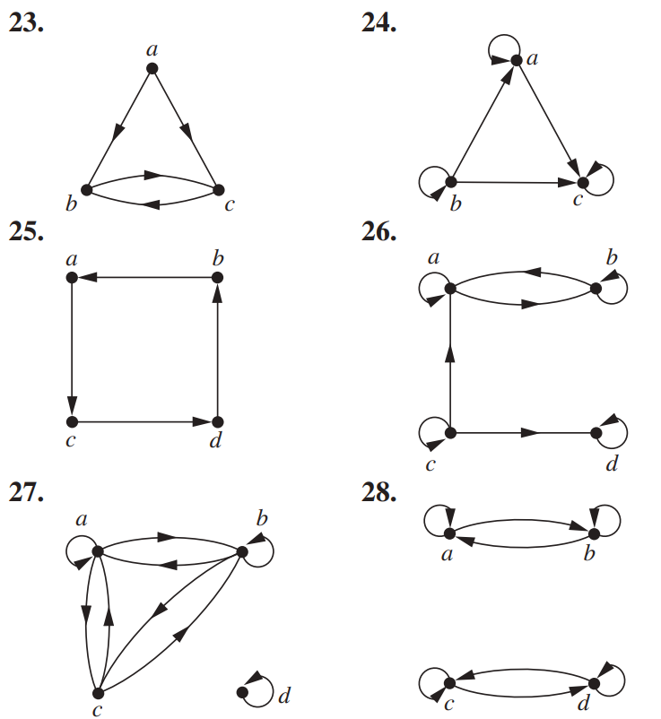

# L7 Uge 11

## 1

### 9.1 Opg 3

For each of these relations on the set $\{1, 2, 3, 4\}$, decide whether it is reflexive, whether it is symmetric, whether it is antisymmetric, and whether it is transitive

A) $\{(2,2),(2,3),(2,4),(3,2),(3,3),(3,4)\}$

- Ikke reflexive
- Ikke symetrisk
- Transitiv

B) $\{(1,1),(1,2),(2,1),(2,2),(3,3),(4,4)\}$

- Reflexive
- Symetrisk
- Ikke transitiv

D) $\{(1,2),(2,3),(3,4)\}$

- Ikke reflexive
- Antisymetrisk
- Ikke transitiv

### 9.1 Opg 7

Determine whether the relation R on the set of all integers is reflexive, symmetric, antisymmetric, and/or transitive, where $(x, y) \in R$ if and only if

A) $x \neq y$

- Ikke reflexsiv
- Symetrisk
- Ikke transitiv

C) $x=y+1$ or $x=y-1$

- Ikke reflexsive
- Symetrisk
- Ikke transitiv

F) $x$ and $y$ are both negative or both nonnegative

- Reflexsiv
- Symetrisk
- Transitiv

## 2

### 9.3 Opg 31

Determine whether the relations represented by the directed graphs shown in Exercises 23–25 are reflexive, irreflexive, symmetric, antisymmetric, and/or transitive

23:

- Ikke reflexsiv
- Ikke symetrisk
- Ikke transitiv

24:

- Reflexsiv
- Antisymetrisk
- Ikke transitiv

25:

- Ikke reflexsiv
- Antisymetrisk
- Ikke transitiv

## 3

### DM547 Reexamen febuar 2016 Opgave 3

Lad $S_n = \sum_{i=0}^n(i+1)\cdot2^i$, for $i \in \N$

A) Beregn $S_0$, $S_1$ og $S_2$

$S_0 = (0 + 1) \cdot 2^0 = 1 \cdot 1 = 1$

$S_1 = (1 + 1) \cdot 2^1 + S_0 = 2 \cdot 2 + 1 = 5$

$S_2 = (2 + 1) \cdot 2^2 + S_1 = 3 \cdot 4 + 5 = 17$

B) Vis v.h.a. induktion, at $S_n=n\cdot 2^{n+1}+1$, for $n \ge 1$

Basis case $n = 1$:

$LHS: ((0 + 1) \cdot 2^0) + ((1 + 1) \cdot 2^1) = 5$

$RHS: 1 \cdot 2^{1+1} + 1 = 5$

Antagelse:

$\sum_{i=0}^k (i+1) \cdot 2^i = k \cdot 2^{k+1} + 1$, for $k \ge 1$

Vi skal vise at:

$\sum_{i=0}^{k+1} (i+1) \cdot 2^i = (k+1) \cdot 2^{k+2} + 1$

Induktionsskridt:

$\sum_{i=0}^{k+1} (i+1) \cdot 2^i = \sum_{i=0}^k [(i+1) \cdot 2^i] + (k+1) \cdot 2^{k+1}$

Induktions hypotese

$(k \cdot 2^{k+1} + 1) + ((k+2) \cdot 2^{k+1})$

$ = (k \cdot 2^{k+1} + 1) + (k \cdot 2^{k+1} + 2 \cdot 2^{k+1})$

$ = 2 k \cdot 2^{k+1} + 2 \cdot 2^{k+1} + 1$

$ = k \cdot 2^{k+2} + 2^{k+2} + 1$

$ = (k+1) \cdot 2^{k+2} + 1$

$\square$

## 4

### DM547 Reexamen marts 2019 Opgave 4

Hvilke af nedstående argumenter udgår gyldige bevise for følgende udsagn?

Hvis $n$ er lige, er $n+4$ også lige

Svar 4.1: $\exists k \in \Z: n = 2k \Rightarrow \exist k \in \Z: n + 4 = 2k + 4 = 2 (k + 2)$ $\checkmark$

Svar 4.2: $\exists k \in \Z: n = 2k + 1 \Rightarrow \exist k \in \Z: n + 4 = 2k + 1 + 4 = 2 (k + 2) + 1$

Svar 4.3: $\exists k \in \Z: n = 2(k - 2) \Rightarrow \exist k \in \Z: n + 4 = 2(k - 2) + 4 = 2k$ $\checkmark$

Svar 4.4: $\exists k \in \Z: n + 4 = 2k + 1 \Rightarrow \exist k \in \Z: n = 2k + 1 - 4 = 2 (k - 2) + 1$

Svar 4.5: $\exists k \in \Z: n + 4 = 2k \Rightarrow \exist k \in \Z: n = 2k - 4 = 2 (k - 2)$ $\checkmark$

Svar 4.6: $\exists k \in \Z: n + 4 = 2(k + 2) = 2k + 4 \Rightarrow \exist k \in \Z: n = 2k + 4 - 4 = 2k$ $\checkmark$
